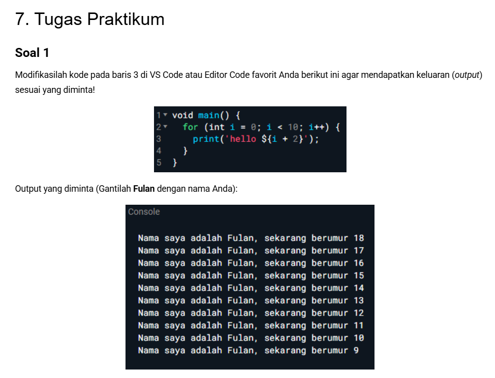
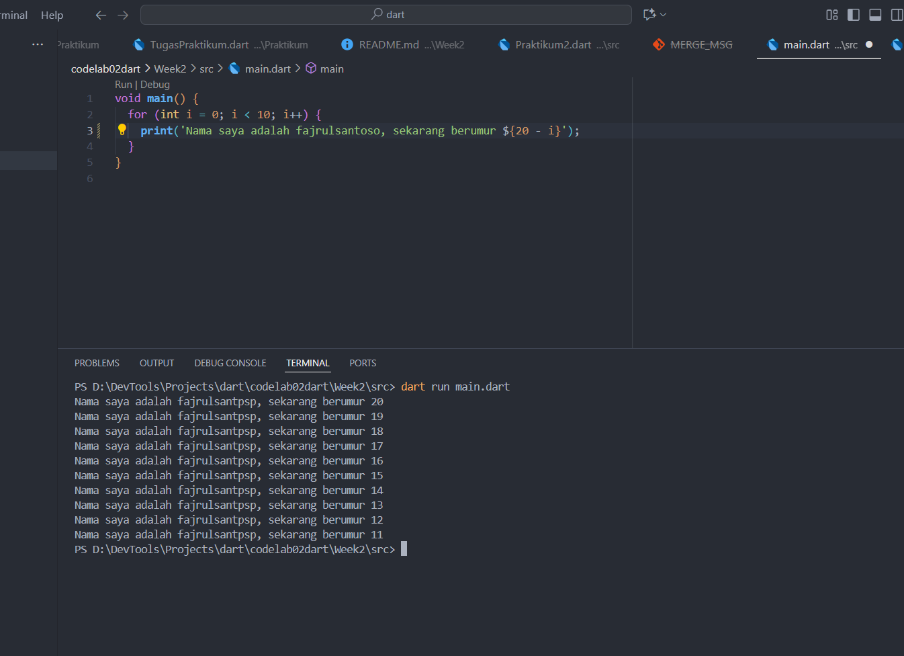

# Pemrograman Mobile - Week 2

## Biodata
- **Nama**: Fajrul Santoso  
- **Kelas**: 3H  
- **Prodi**: D-IV Teknik Informatika  

  ## SOAL 1

 

 ## JAWABAN SOAL 1

 

 ## JAWABAN SOAL 2
**Mengapa sangat penting untuk memahami bahasa pemrograman Dart sebelum kita menggunakan framework Flutter ? Jelaskan!**

Memahami Dart sangat penting sebelum menggunakan Flutter karena Flutter sepenuhnya dibangun dengan Dart. Jika tidak menguasai dasar Dart, akan sulit memahami cara kerja widget, logika program, dan pengelolaan data di Flutter. Dengan menguasai Dart, kita lebih mudah membuat aplikasi, membaca dokumentasi, serta menyelesaikan error saat pengembangan.
