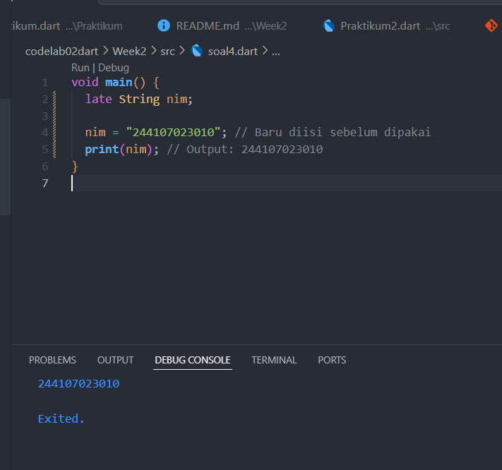

# Pemrograman Mobile - Week 2

## Biodata
- **Nama**: Fajrul Santoso  
- **Kelas**: 3H  
- **Prodi**: D-IV Teknik Informatika  

  ## SOAL 1

 

 ## JAWABAN SOAL 1

 

 ## JAWABAN SOAL 2
**Mengapa sangat penting untuk memahami bahasa pemrograman Dart sebelum kita menggunakan framework Flutter ? Jelaskan!**

Memahami Dart sangat penting sebelum menggunakan Flutter karena Flutter sepenuhnya dibangun dengan Dart. Jika tidak menguasai dasar Dart, akan sulit memahami cara kerja widget, logika program, dan pengelolaan data di Flutter. Dengan menguasai Dart, kita lebih mudah membuat aplikasi, membaca dokumentasi, serta menyelesaikan error saat pengembangan.

## JAWABAN SOAL 3
 **Rangkumlah materi dari codelab ini menjadi poin-poin penting yang dapat Anda gunakan untuk membantu proses pengembangan aplikasi mobile menggunakan framework Flutter.**

## Poin Penting
- **Dart**: bahasa utama untuk Flutter.  
- **Widget**: semua tampilan adalah widget.  
- **Stateless & Stateful**: tampilan tetap vs bisa berubah.  
- **Hot Reload**: lihat hasil perubahan kode dengan cepat.  
- **Layout**: gunakan Row, Column, Container, Stack.  
- **Navigasi**: pindah antar halaman.  
- **State Management**: atur data agar sinkron dengan UI.  
- **Paket & Plugin**: tambah fitur (kamera, HTTP, database).  
- **Cross-Platform**: 1 kode jalan di Android, iOS, Web, Desktop.  

## Kesimpulan
Dengan memahami dasar ini, pengembangan aplikasi Flutter jadi lebih mudah dan efisien.
<<<<<<< HEAD

## JAWABAN SOAL 4

**Buatlah penjelasan dan contoh eksekusi kode tentang perbedaan Null Safety dan Late variabelKumpulkan jawaban Anda kepada dosen pengampu sesuai kesepakatan di kelas**

## Null Safety**
mencegah error karena nilai null.
Variabel default tidak boleh null, kecuali ditandai dengan ?.
## Contoh:**
 

## late Variable**
late digunakan untuk menunda inisialisasi variabel.
Wajib diberi nilai sebelum digunakan.
## Contoh:**
 

## Perbedaan Utama

**Null Safety (?) → variabel bisa null, aman dari error saat compile.**

**late → inisialisasi ditunda, tapi harus ada nilai sebelum dipakai.**

✍️ Dibuat oleh: Fajrul Santoso (244107023010)
=======
>>>>>>> 8c43c7e (Week4)
