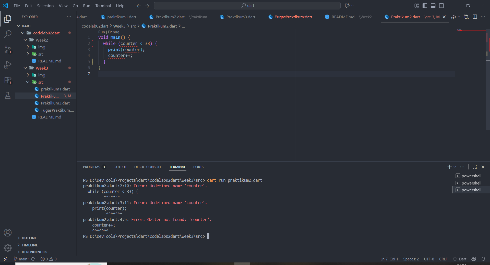
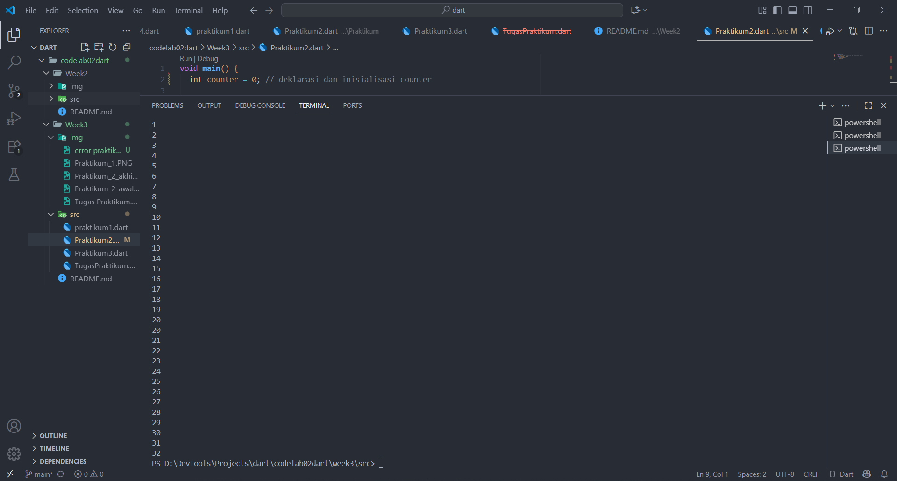
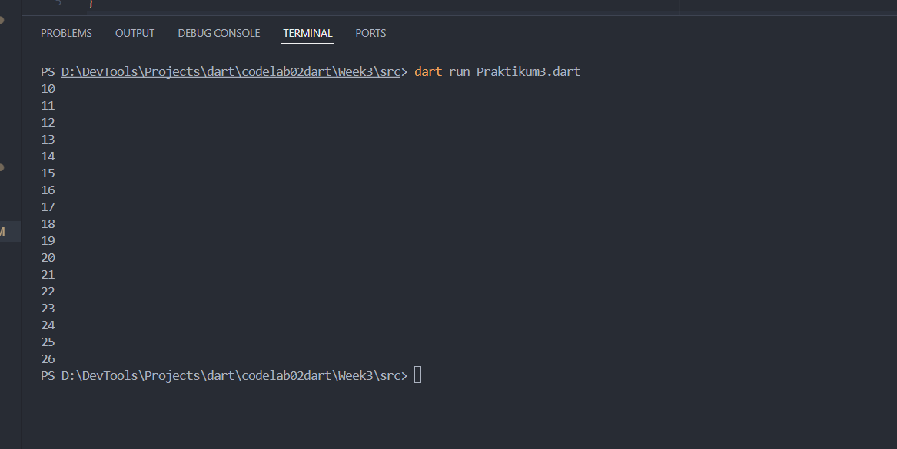
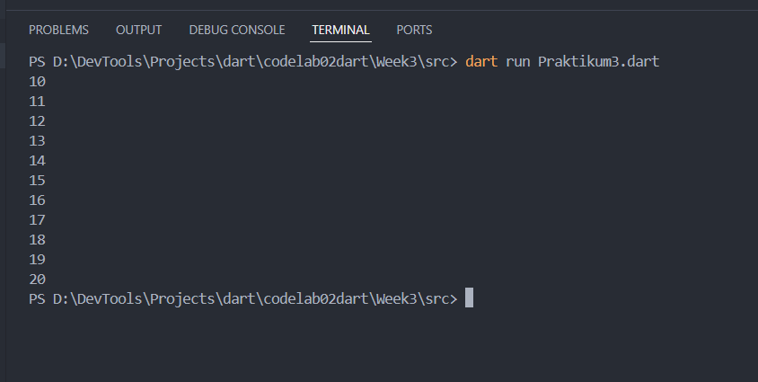

# Pemrograman Mobile - Week 3

## Biodata
- **Nama**: Fajrul Santoso  
- **Kelas**: 3H  
- **Prodi**: D-IV Teknik Informatika  

  ## Praktikum 1
 

 ## Penjelasan 
 memakai if/else untuk mengecek variabel. Karena test = "test2" dan isTrue = true, program menampilkan "Test2", "Test2 again", dan "Kebenaran". Nilai ujian 85 ≥ 80, maka muncul "Nilai bagus".
program ini memperlihatkan penggunaan percabangan (if-else) dan logika sederhana dalam Dart.

## Praktikum 2 error

Masalah: variabel counter belum pernah dideklarasikan.
Hasilnya saat Run → muncul error Undefined name 'counter'

## Praktikum 2 Awal

deklarasikan dan inisialisasi dulu variabel counter maka akan menampilkan 1 sampai 32

## Praktikum 2 akhir

Do-while loop → mulai dari nilai counter = 33, terus mencetak sampai 76.
Jadi total output 0 sampai 76.

## Praktikum 3 akhir

Program ini menggunakan perulangan for untuk mencetak angka mulai dari 10 hingga 26. Pada kode ditambahkan dua kontrol alur yaitu break dan continue. Perintah break digunakan untuk menghentikan perulangan sepenuhnya ketika nilai index mencapai 21, sehingga angka setelah 21 tidak akan dicetak. Sementara itu, perintah continue digunakan untuk melewati iterasi tertentu, namun pada kasus ini kondisinya tidak terpenuhi karena perulangan dimulai dari angka 10. Hasil akhirnya, program hanya menampilkan angka 10 sampai 20 di laya
