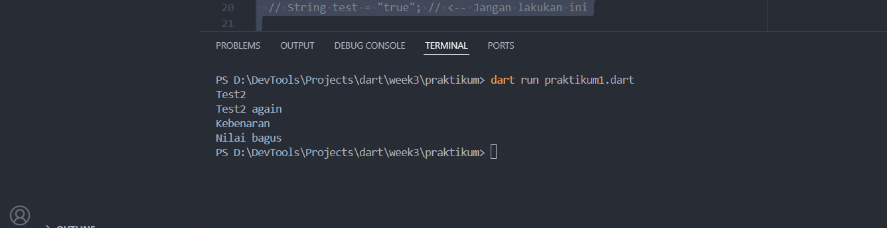
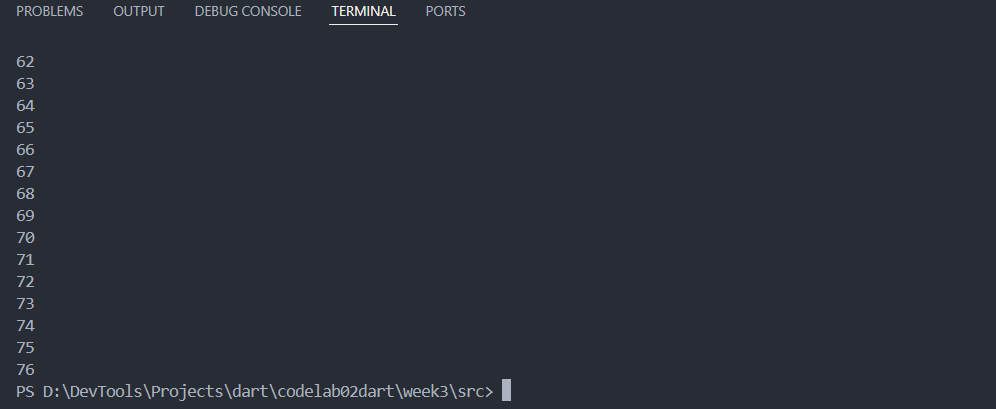

# Pemrograman Mobile - Week 3

## Biodata
- **Nama**: Fajrul Santoso  
- **Kelas**: 3H  
- **Prodi**: D-IV Teknik Informatika  

  ## Praktikum 1
 

 ## Penjelasan 
 memakai if/else untuk mengecek variabel. Karena test = "test2" dan isTrue = true, program menampilkan "Test2", "Test2 again", dan "Kebenaran". Nilai ujian 85 ≥ 80, maka muncul "Nilai bagus".
program ini memperlihatkan penggunaan percabangan (if-else) dan logika sederhana dalam Dart.
## Praktikum 2 Awal
 
