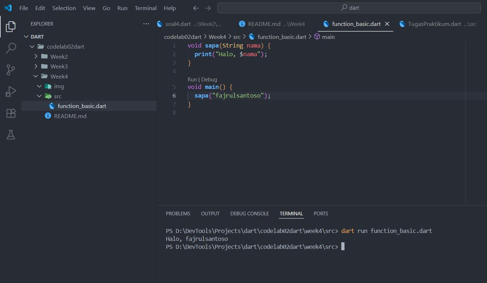
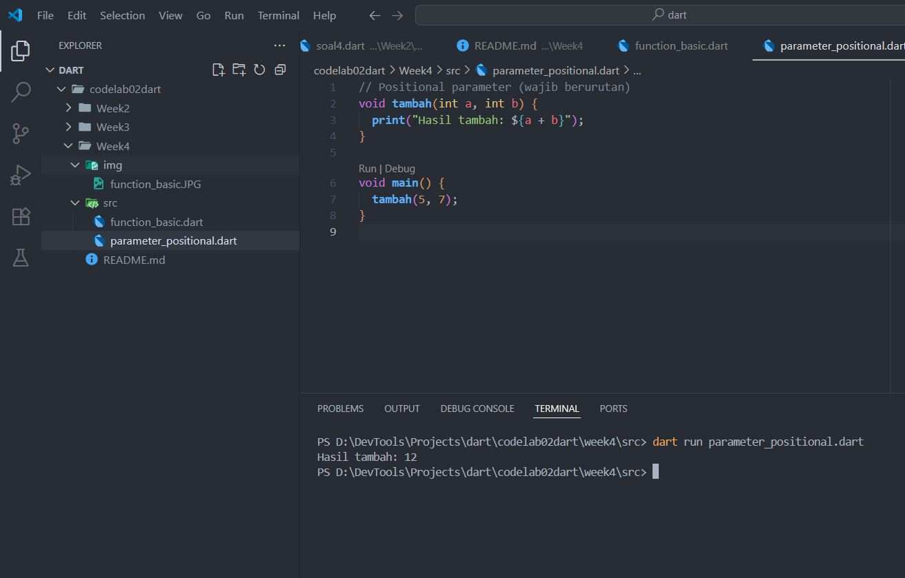
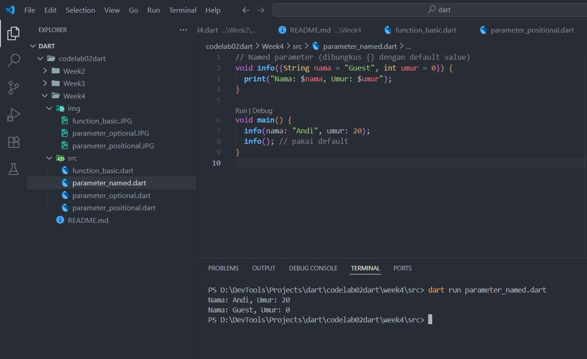
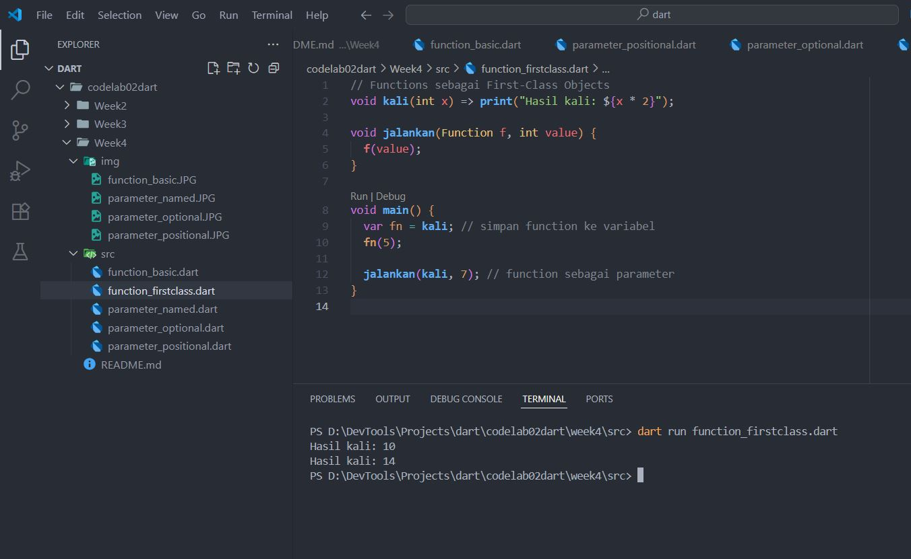
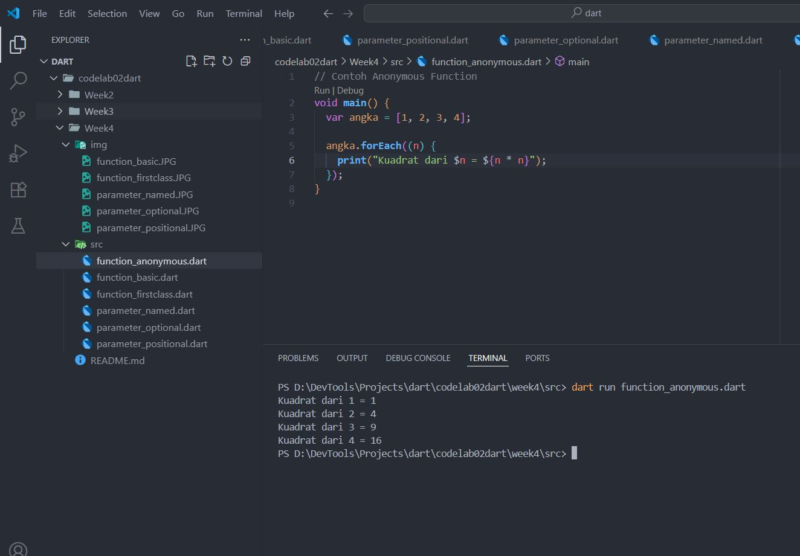
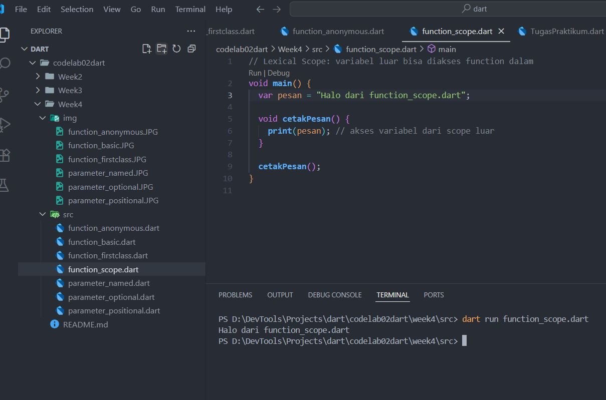
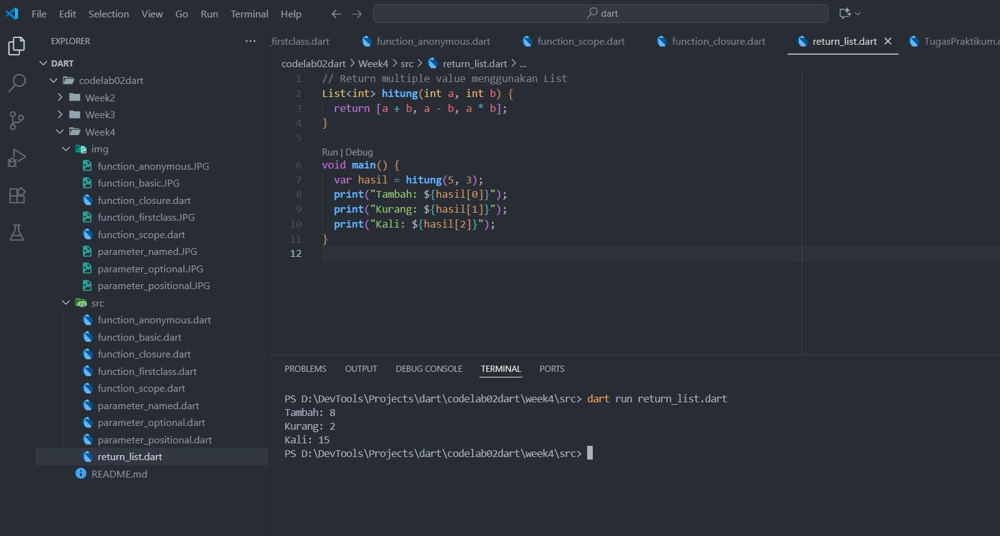

# Praktikum Week 4 - Functions di Dart

## 1. Apa yang dimaksud dengan Functions dalam bahasa Dart?
Functions adalah blok kode yang dapat dipanggil untuk melakukan tugas tertentu.  
Mereka membuat program lebih modular, mengurangi duplikasi, dan mudah dipelihara.

📄 Contoh kode: `src/function_basic.dart`  
🖼️ Hasil eksekusi:  

---

## 2. Jenis-jenis Parameter di Functions

### a. Positional Parameter
Parameter yang wajib berurutan.  
📄 Contoh kode: `src/parameter_positional.dart`  
🖼️ Hasil eksekusi:  

### b. Optional Positional Parameter
Parameter opsional, dibungkus dengan `[]`.  
📄 Contoh kode: `src/parameter_optional.dart`  
🖼️ Hasil eksekusi:  

### c. Named Parameter
Parameter dibungkus `{}` dan bisa diberikan default value.  
📄 Contoh kode: `src/parameter_named.dart`  
🖼️ Hasil eksekusi:  

---

## 3. Functions sebagai First-Class Objects
Function di Dart diperlakukan sebagai objek, sehingga bisa:
- Disimpan dalam variabel  
- Dikirim sebagai parameter  
- Dikembalikan dari function lain  

📄 Contoh kode: `src/function_firstclass.dart`  
🖼️ Hasil eksekusi:  

---

## 4. Anonymous Functions
Anonymous function adalah function tanpa nama.  
Biasanya dipakai sebagai callback atau untuk operasi sederhana.  

📄 Contoh kode: `src/function_anonymous.dart`  
🖼️ Hasil eksekusi:  

---

## 5. Lexical Scope dan Lexical Closures

### a. Lexical Scope
Scope ditentukan oleh posisi penulisan kode.  
📄 Contoh kode: `src/function_scope.dart`  
🖼️ Hasil eksekusi:  

### b. Lexical Closure
Closure adalah function yang membawa variabel dari scope luar meskipun scope luar sudah selesai dieksekusi.  
📄 Contoh kode: `src/function_closure.dart`  
🖼️ Hasil eksekusi:  

---

## 6. Return Multiple Value di Functions

### a. Dengan List
📄 Contoh kode: `src/return_list.dart`  
🖼️ Hasil eksekusi:  

### b. Dengan Record (Dart 3)
📄 Contoh kode: `src/return_record.dart`  
🖼️ Hasil eksekusi:  

