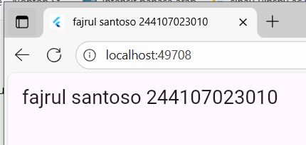
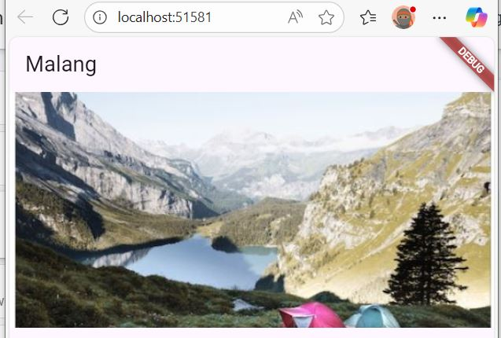
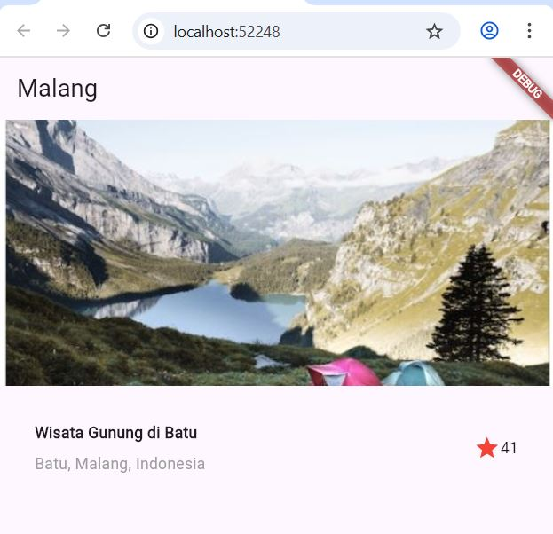
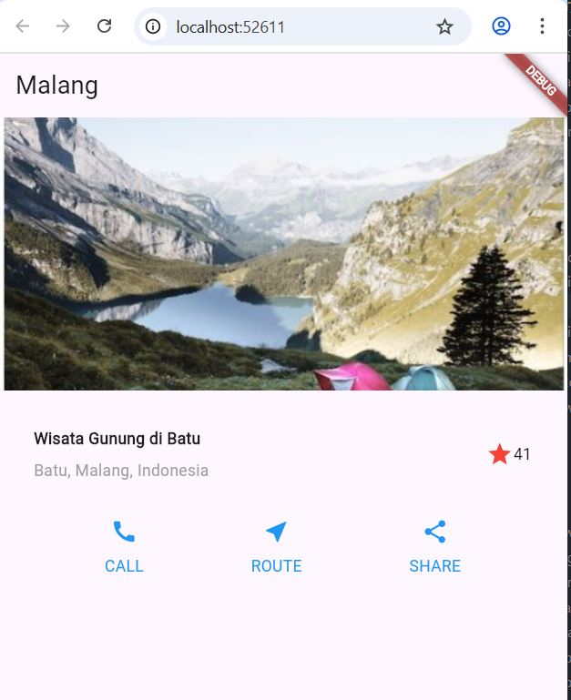
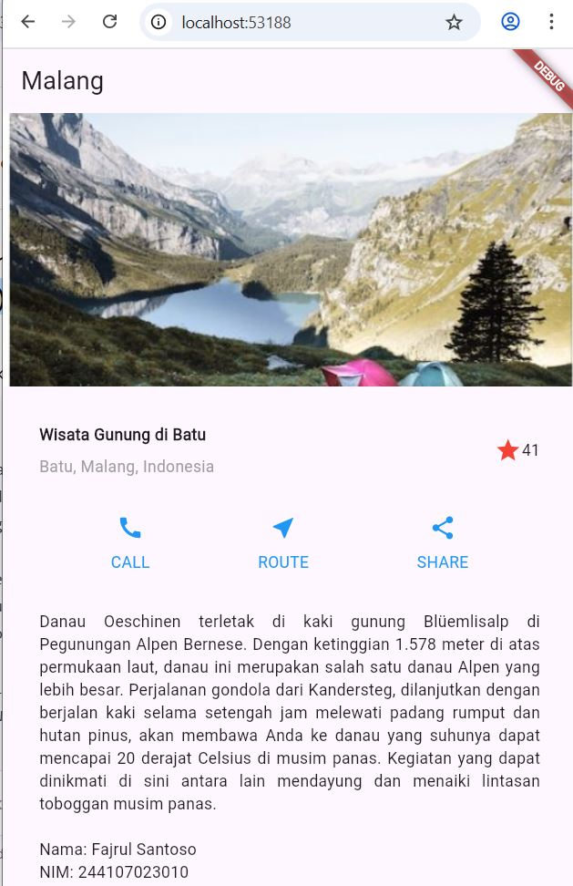

# 📘 Laporan Praktikum Flutter - Layout Demo

## 📌 Identitas
- **Nama**  : Fajrul Santoso  
- **NIM**   : 244107023010  

---

## 🧩 Praktikum 1: Membangun Layout di Flutter  

### 💻 Source Code  
```dart
import 'package:flutter/material.dart';

void main() => runApp(const MyApp());

class MyApp extends StatelessWidget {
  const MyApp({super.key});

  @override
  Widget build(BuildContext context) {
    return MaterialApp(
      title: 'FAJRUL SANTOSO  244107023010',
      home: Scaffold(
        appBar: AppBar(
          title: const Text('FAJRUL SANTOSO  244107023010'),
        ),
        body: const Center(
          child: Text('FAJRUL SANTOSO  244107023010'),
        ),
      ),
    );
  }
}
```

---


### 📸 Jawaban Screenshots  

#### 1️⃣ Membangun Layout di Flutter  
  

## Praktikum 2: Implementasi button row
## Langkah 1: Buat method Column _buildButtonColumn
### 💻 Source Code  
```dart
import 'package:flutter/material.dart';

class MyApp extends StatelessWidget {
  const MyApp({super.key});

  @override
  Widget build(BuildContext context) {
    // ···
  }

  Column _buildButtonColumn(Color color, IconData icon, String label) {
    return Column(
      mainAxisSize: MainAxisSize.min,
      mainAxisAlignment: MainAxisAlignment.center,
      children: [
        Icon(icon, color: color),
        Container(
          margin: const EdgeInsets.only(top: 8),
          child: Text(
            label,
            style: TextStyle(
              fontSize: 12,
              fontWeight: FontWeight.w400,
              color: color,
            ),
          ),
        ),
      ],
    );
  }
}
```

---
## Langkah 2: Buat widget buttonSection
```dart
Color color = Theme.of(context).primaryColor;

Widget buttonSection = Row(
  mainAxisAlignment: MainAxisAlignment.spaceEvenly,
  children: [
    _buildButtonColumn(color, Icons.call, 'CALL'),
    _buildButtonColumn(color, Icons.near_me, 'ROUTE'),
    _buildButtonColumn(color, Icons.share, 'SHARE'),
  ],
);
```

---
## Praktikum 3: Implementasi text section

## Langkah 1: Buat widget textSection 
```dart
Widget textSection = Container(
  padding: const EdgeInsets.all(32),
  child: const Text(
    'Carilah teks di internet yang sesuai '
    'dengan foto atau tempat wisata yang ingin '
    'Anda tampilkan. '
    'Tambahkan nama dan NIM Anda sebagai '
    'identitas hasil pekerjaan Anda. '
    'Selamat mengerjakan 🙂.',
    softWrap: true,
  ),
);
```

---

## Praktikum 4: Implementasi image section
## Langkah 1: Siapkan aset gambar
  

#### 2️⃣ Menambahkan Gambar  
  

#### 3️⃣ Menambahkan Title Row (Judul, Lokasi, dan Bintang)  
  

#### 4️⃣ Menambahkan Button Row (CALL / ROUTE / SHARE)  
  

#### 5️⃣ Menambahkan Deskripsi (Text Section)  
  

---

## 📝 Tugas Praktikum 1
Selesaikan **Praktikum 1 sampai 4**, lalu dokumentasikan dan push ke repository Anda berupa screenshot setiap hasil pekerjaan beserta penjelasannya di file `README.md`.  

Silakan implementasikan di project baru **`basic_layout_flutter`** dengan mengakses sumber ini:  
🔗 [Flutter Layout Basics](https://docs.flutter.dev/codelabs/layout-basics)  

Kumpulkan link commit repository GitHub Anda kepada dosen yang telah disepakati!  
