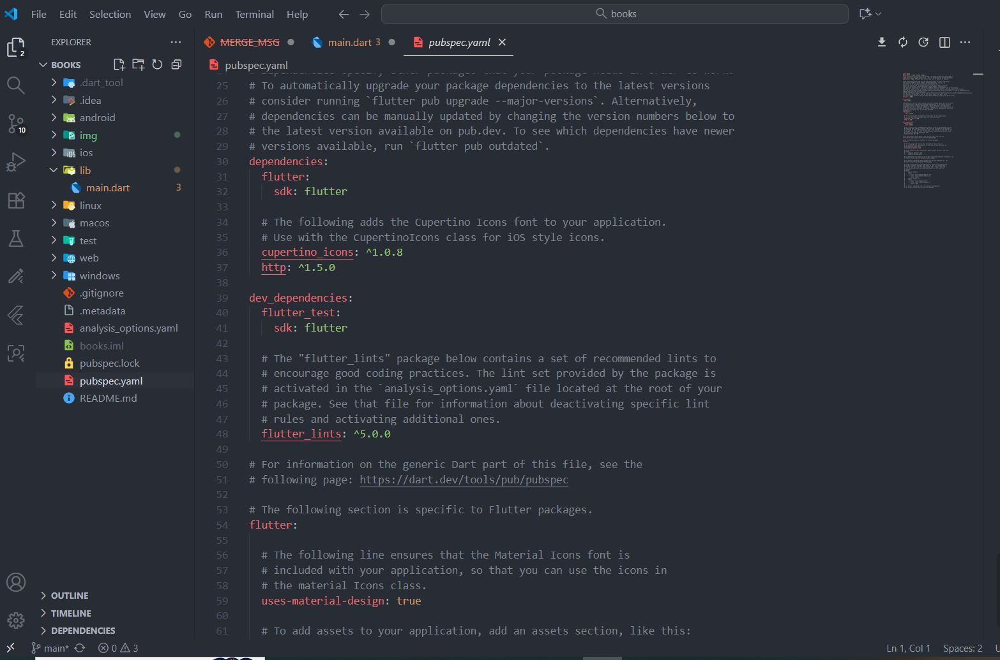
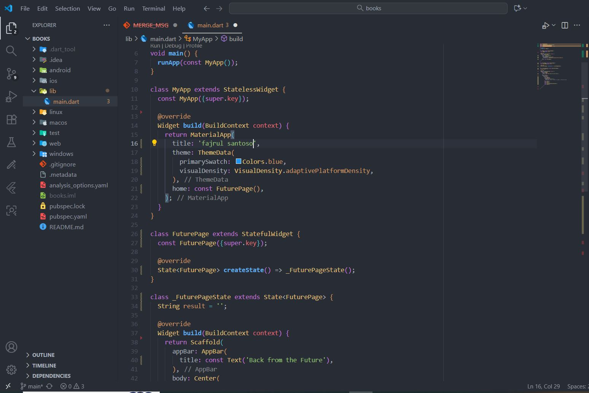
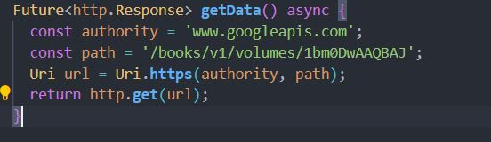
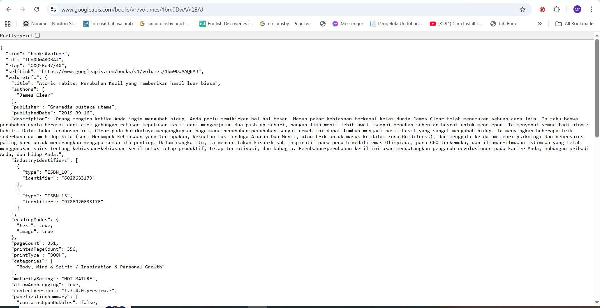
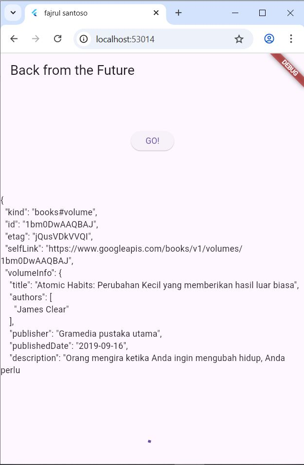

# 3. Praktikum 1: Mengunduh Data dari Web Service (API) 
## Langkah 1: Buat Project Baru
Buatlah sebuah project flutter baru dengan nama books di folder src week-11 repository GitHub Anda.

Kemudian Tambahkan dependensi http dengan mengetik perintah berikut di terminal.


### 💻 Source Code  
```dart
flutter pub add http

```

---


## Langkah 2: Cek file pubspec.yaml
Jika berhasil install plugin, pastikan plugin http telah ada di file pubspec ini seperti berikut. 


### 💻 Source Code  
```dart
dependencies:
  flutter:
    sdk: flutter
  http: ^1.1.0
```

---
## JAWABAN



## Langkah 3: Buka file main.dart
Ketiklah kode seperti berikut ini. 
### 💻 Source Code  
```dart
import 'dart:async';
import 'package:flutter/material.dart';
import 'package:http/http.dart';
import 'package:http/http.dart' as http;

void main() {
  runApp(const MyApp());
}

class MyApp extends StatelessWidget {
  const MyApp({super.key});

  @override
  Widget build(BuildContext context) {
    return MaterialApp(
      title: 'Future Demo',
      theme: ThemeData(
        primarySwatch: Colors.blue,
        visualDensity: VisualDensity.adaptivePlatformDensity,
      ),
      home: const FuturePage(),
    );
  }
}

class FuturePage extends StatefulWidget {
  const FuturePage({super.key});

  @override
  State<FuturePage> createState() => _FuturePageState();
}

class _FuturePageState extends State<FuturePage> {
  String result = '';

  @override
  Widget build(BuildContext context) {
    return Scaffold(
      appBar: AppBar(
        title: const Text('Back from the Future'),
      ),
      body: Center(
        child: Column(
          children: [
            const Spacer(),
            ElevatedButton(
              child: const Text('GO!'),
              onPressed: () {}, // Seperti di gambar, onPressed kosong
            ),
            const Spacer(),
            Text(result),
            const Spacer(),
            const CircularProgressIndicator(),
            const Spacer(),
          ],
        ),
      ),
    );
  }
}
```

---
## Soal 1
Tambahkan nama panggilan Anda pada title app sebagai identitas hasil pekerjaan Anda.
## JAWABAN



## Langkah 4: Tambah method getData()
Tambahkan method ini ke dalam class _FuturePageState yang berguna untuk mengambil data dari API Google Books.


### 💻 Source Code  
```dart
Future<http.Response> getData() async {
  const authority = 'www.googleapis.com';
  const path = '/books/v1/volumes/junbDWAQBAJ';
  Uri url = Uri.https(authority, path);
  return http.get(url);
}
```

---

## JAWABAN


## Soal 2
Carilah judul buku favorit Anda di Google Books, lalu ganti ID buku pada variabel path di kode tersebut. Caranya ambil di URL browser Anda seperti gambar berikut ini. 
Kemudian cobalah akses di browser URI tersebut dengan lengkap seperti ini. Jika menampilkan data JSON, maka Anda telah berhasil. Lakukan capture milik Anda dan tulis di README pada laporan praktikum. Lalu lakukan commit dengan pesan "W11: Soal 2".

## JAWABAN
 
  


## Langkah 5: Tambah kode di ElevatedButton
Tambahkan kode pada onPressed di ElevatedButton seperti berikut. 

### 💻 Source Code  
```dart
ElevatedButton(
  child: Text('GO!'),
  onPressed: () {
    setState(() {});
    getData()
      .then((value) {
        result = value.body.toString().substring(0, 450);
        setState(() {});
      }).catchError((_) {
        result = 'An error occurred';
        setState(() {});
      });
  },
),
```

--- 

## Soal 3
## 1 Jelaskan maksud kode langkah 5 tersebut terkait substring dan catchError!
## jawaban  
Kode substring(0, 450) berfungsi menampilkan hanya 450 karakter pertama dari data JSON agar tampilan tidak terlalu panjang.
Sedangkan catchError digunakan untuk menangani kesalahan saat mengambil data dari API, sehingga jika terjadi error, aplikasi tidak crash dan menampilkan pesan “An error occurred”.
## 2 Capture hasil praktikum Anda berupa GIF dan lampirkan di README. Lalu lakukan commit dengan pesan "W11: Soal 3".
## Jawaban
  


## 4. Praktikum 2: Menggunakan await/async untuk menghindari callbacks
Ada alternatif penggunaan Future yang lebih clean, mudah dibaca dan dirawat, yaitu pola async/await. Intinya pada dua kata kunci ini:

async digunakan untuk menandai suatu method sebagai asynchronous dan itu harus ditambahkan di depan kode function.
await digunakan untuk memerintahkan menunggu sampai eksekusi suatu function itu selesai dan mengembalikan sebuah value. Untuk then bisa digunakan pada jenis method apapun, sedangkan await hanya bekerja di dalam method async. 

## Langkah 1: Buka file main.dart
Tambahkan tiga method berisi kode seperti berikut di dalam class _FuturePageState. 

### 💻 Source Code  
```dart
Future<int> returnOneAsync() async {
  await Future.delayed(const Duration(seconds: 3));
  return 1;
}

Future<int> returnTwoAsync() async {
  await Future.delayed(const Duration(seconds: 3));
  return 2;
}

Future<int> returnThreeAsync() async {
  await Future.delayed(const Duration(seconds: 3));
  return 3;
}
```

--- 
