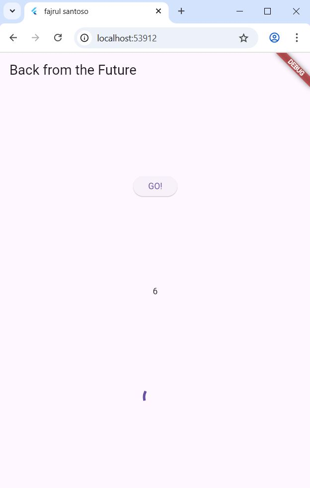
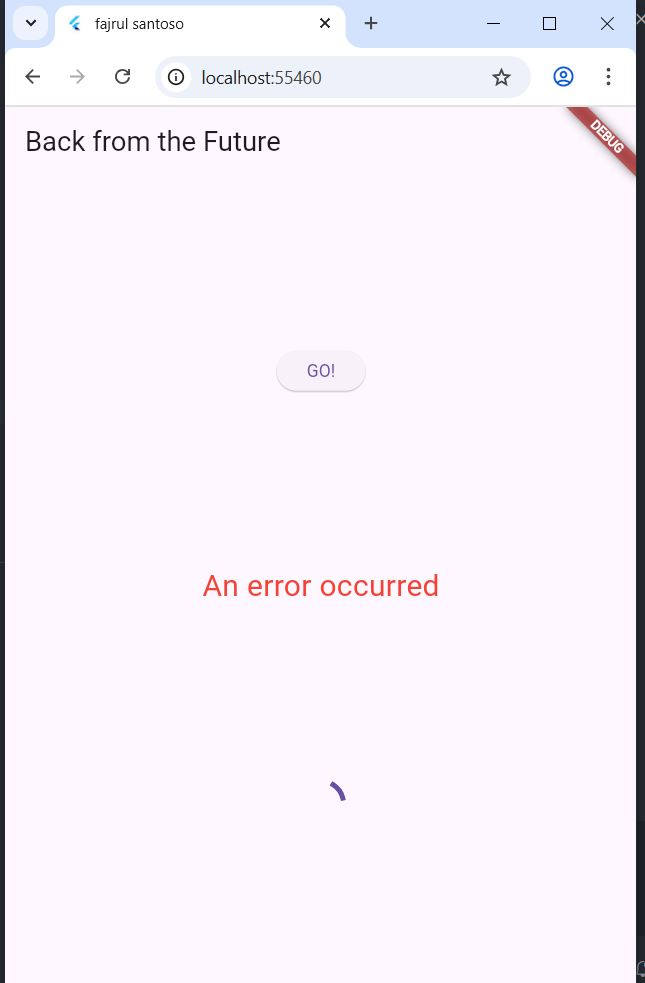
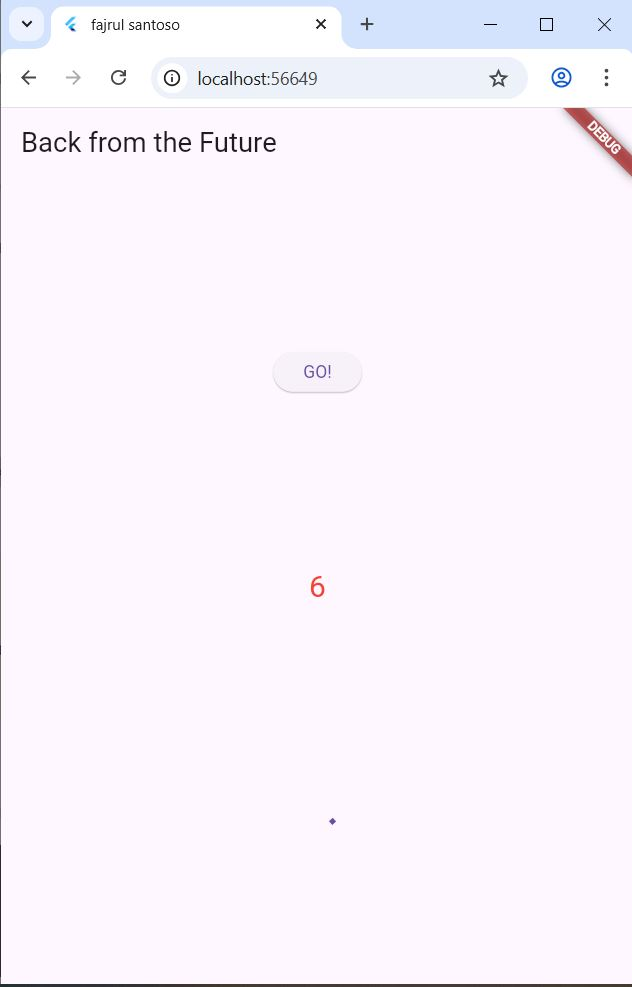
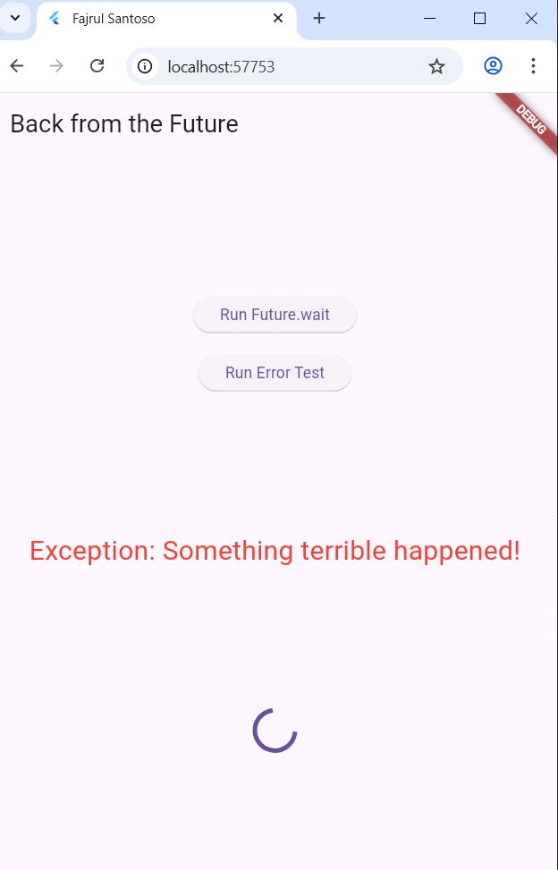

# 3. Praktikum 1: Mengunduh Data dari Web Service (API) 
## Langkah 1: Buat Project Baru
Buatlah sebuah project flutter baru dengan nama books di folder src week-11 repository GitHub Anda.

Kemudian Tambahkan dependensi http dengan mengetik perintah berikut di terminal.


### 💻 Source Code  
```dart
flutter pub add http

```

---


## Langkah 2: Cek file pubspec.yaml
Jika berhasil install plugin, pastikan plugin http telah ada di file pubspec ini seperti berikut. 


### 💻 Source Code  
```dart
dependencies:
  flutter:
    sdk: flutter
  http: ^1.1.0
```

---
## JAWABAN


## Langkah 3: Buka file main.dart
Ketiklah kode seperti berikut ini. 
### 💻 Source Code  
```dart
import 'dart:async';
import 'package:flutter/material.dart';
import 'package:http/http.dart';
import 'package:http/http.dart' as http;

void main() {
  runApp(const MyApp());
}

class MyApp extends StatelessWidget {
  const MyApp({super.key});

  @override
  Widget build(BuildContext context) {
    return MaterialApp(
      title: 'Future Demo',
      theme: ThemeData(
        primarySwatch: Colors.blue,
        visualDensity: VisualDensity.adaptivePlatformDensity,
      ),
      home: const FuturePage(),
    );
  }
}

class FuturePage extends StatefulWidget {
  const FuturePage({super.key});

  @override
  State<FuturePage> createState() => _FuturePageState();
}

class _FuturePageState extends State<FuturePage> {
  String result = '';

  @override
  Widget build(BuildContext context) {
    return Scaffold(
      appBar: AppBar(
        title: const Text('Back from the Future'),
      ),
      body: Center(
        child: Column(
          children: [
            const Spacer(),
            ElevatedButton(
              child: const Text('GO!'),
              onPressed: () {}, // Seperti di gambar, onPressed kosong
            ),
            const Spacer(),
            Text(result),
            const Spacer(),
            const CircularProgressIndicator(),
            const Spacer(),
          ],
        ),
      ),
    );
  }
}
```

---
## Soal 1
Tambahkan nama panggilan Anda pada title app sebagai identitas hasil pekerjaan Anda.
## JAWABAN


## Langkah 4: Tambah method getData()
Tambahkan method ini ke dalam class _FuturePageState yang berguna untuk mengambil data dari API Google Books.


### 💻 Source Code  
```dart
Future<http.Response> getData() async {
  const authority = 'www.googleapis.com';
  const path = '/books/v1/volumes/junbDWAQBAJ';
  Uri url = Uri.https(authority, path);
  return http.get(url);
}
```

---

## JAWABAN


## Soal 2
Carilah judul buku favorit Anda di Google Books, lalu ganti ID buku pada variabel path di kode tersebut. Caranya ambil di URL browser Anda seperti gambar berikut ini. 
Kemudian cobalah akses di browser URI tersebut dengan lengkap seperti ini. Jika menampilkan data JSON, maka Anda telah berhasil. Lakukan capture milik Anda dan tulis di README pada laporan praktikum. Lalu lakukan commit dengan pesan "W11: Soal 2".

## JAWABAN
 
  


## Langkah 5: Tambah kode di ElevatedButton
Tambahkan kode pada onPressed di ElevatedButton seperti berikut. 

### 💻 Source Code  
```dart
ElevatedButton(
  child: Text('GO!'),
  onPressed: () {
    setState(() {});
    getData()
      .then((value) {
        result = value.body.toString().substring(0, 450);
        setState(() {});
      }).catchError((_) {
        result = 'An error occurred';
        setState(() {});
      });
  },
),
```

--- 

## Soal 3
## 1 Jelaskan maksud kode langkah 5 tersebut terkait substring dan catchError!
## jawaban  
Kode substring(0, 450) berfungsi menampilkan hanya 450 karakter pertama dari data JSON agar tampilan tidak terlalu panjang.
Sedangkan catchError digunakan untuk menangani kesalahan saat mengambil data dari API, sehingga jika terjadi error, aplikasi tidak crash dan menampilkan pesan “An error occurred”.
## 2 Capture hasil praktikum Anda berupa GIF dan lampirkan di README. Lalu lakukan commit dengan pesan "W11: Soal 3".
## Jawaban
  


## 4. Praktikum 2: Menggunakan await/async untuk menghindari callbacks
Ada alternatif penggunaan Future yang lebih clean, mudah dibaca dan dirawat, yaitu pola async/await. Intinya pada dua kata kunci ini:

async digunakan untuk menandai suatu method sebagai asynchronous dan itu harus ditambahkan di depan kode function.
await digunakan untuk memerintahkan menunggu sampai eksekusi suatu function itu selesai dan mengembalikan sebuah value. Untuk then bisa digunakan pada jenis method apapun, sedangkan await hanya bekerja di dalam method async. 

## Langkah 1: Buka file main.dart
Tambahkan tiga method berisi kode seperti berikut di dalam class _FuturePageState. 

### 💻 Source Code  
```dart
Future<int> returnOneAsync() async {
  await Future.delayed(const Duration(seconds: 3));
  return 1;
}

Future<int> returnTwoAsync() async {
  await Future.delayed(const Duration(seconds: 3));
  return 2;
}

Future<int> returnThreeAsync() async {
  await Future.delayed(const Duration(seconds: 3));
  return 3;
}
```

---   

## Langkah 2: Tambah method count()
Lalu tambahkan lagi method ini di bawah ketiga method sebelumnya. 

### 💻 Source Code  
```dart
Future count() async {
  int total = 0;
  total = await returnOneAsync();
  total += await returnTwoAsync();
  total += await returnThreeAsync();
  setState(() {
    result = total.toString();
  });
}
```

---   


## Langkah 3: Panggil count()
Lakukan comment kode sebelumnya, ubah isi kode onPressed() menjadi seperti berikut. 
### 💻 Source Code  
```dart
ElevatedButton(
  child: Text('GO!'),
  onPressed: () {
    count();
  },
)
```

---   


Langkah 4: Run
Akhirnya, run atau tekan F5 jika aplikasi belum running. Maka Anda akan melihat seperti gambar berikut, hasil angka 6 akan tampil setelah delay 9 detik.

Soal 4
## 1 Jelaskan maksud kode langkah 1 dan 2 tersebut! 
## Langkah 1:
Tiga method returnOneAsync(), returnTwoAsync(), dan returnThreeAsync() digunakan untuk mensimulasikan proses asynchronous (seperti pengambilan data dari server).
Masing-masing menunggu selama 3 detik menggunakan Future.delayed() lalu mengembalikan nilai 1, 2, dan 3.

## Langkah 2:
Method count() menjalankan ketiga method tersebut secara berurutan menggunakan await.
Setiap hasil ditambahkan ke variabel total, lalu hasil akhirnya ditampilkan ke layar melalui setState().
Tujuannya adalah untuk menunjukkan cara kerja async/await dalam menjalankan beberapa proses asynchronous secara berurutan dan menampilkan hasil akhirnya ke UI.
## 2 Capture hasil praktikum Anda berupa GIF dan lampirkan di README. Lalu lakukan commit dengan pesan "W11: Soal 4".
## jawaban 



## 5. Praktikum 3: Menggunakan Completer di Future
Menggunakan Future dengan then, catchError, async, dan await mungkin sudah cukup untuk banyak kasus, tetapi ada alternatif melakukan operasi async di Dart dan Flutter yaitu dengan class Completer.

Completer membuat object Future yang mana Anda dapat menyelesaikannya nanti (late) dengan return sebuah value atau error.  


## Langkah 1: Buka main.dart
Pastikan telah impor package async berikut.  
### 💻 Source Code  
```dart
import 'package:async/async.dart';
```

---   

## Langkah 2: Tambahkan variabel dan method
Tambahkan variabel late dan method di class _FuturePageState seperti ini. 
### 💻 Source Code  
```dart
late Completer completer;

Future getNumber() {
  completer = Completer<int>();
  calculate();
  return completer.future;
}

Future calculate() async {
  await Future.delayed(const Duration(seconds : 5));
  completer.complete(42);
}
```

---   


## Langkah 3: Ganti isi kode onPressed()
Tambahkan kode berikut pada fungsi onPressed(). Kode sebelumnya bisa Anda comment.
### 💻 Source Code  
```dart
getNumber().then((value) {
  setState(() {
    result = value.toString();
  });
});
```

---   
## Soal 5
## 1 Jelaskan maksud kode langkah 2 tersebut! 
## JAWABAN
Penjelasan Langkah 2

Kode pada langkah 2 menggunakan Completer untuk membuat Future secara manual.
getNumber() membuat Future baru dan memanggil calculate(), sedangkan calculate() menunggu 5 detik dengan Future.delayed() lalu menjalankan completer.complete(42) untuk menyelesaikan Future dengan hasil 42.
Artinya, proses asynchronous selesai setelah 5 detik dan menghasilkan nilai 42.
## 2Capture hasil praktikum Anda berupa GIF dan lampirkan di README. Lalu lakukan commit dengan pesan "W11: Soal 5".
## JAWABAN 


## Langkah 5: Ganti method calculate()
Gantilah isi code method calculate() seperti kode berikut, atau Anda dapat membuat calculate2()
### 💻 Source Code  
```dart
calculate() async {
  try {
    await new Future.delayed(const Duration(seconds: 5));
    completer.complete(42);
    
    // throw Exception(); // Bagian ini dikomentari di gambar
  } catch (_) {
    completer.completeError({});
  }
}
```

---    

## Langkah 6: Pindah ke onPressed()
Ganti menjadi kode seperti berikut.
### 💻 Source Code  
```dart
getNumber().then((value) {
  setState(() {
    result = value.toString();
  });
}).catchError((e) {
  result = 'An error occurred';
});
```

---    

## Soal 6
## 1 Jelaskan maksud perbedaan kode langkah 2 dengan langkah 5-6 tersebut!
## Jawaban
Langkah 5: Menambahkan try–catch pada calculate() untuk menangani dua kemungkinan — sukses (complete()) atau gagal (completeError()).
Langkah 6: Menangani hasil Future di UI dengan .then() untuk hasil sukses dan .catchError() untuk menampilkan pesan “An error occurred” jika terjadi error. 

## 2 Capture hasil praktikum Anda berupa GIF dan lampirkan di README. Lalu lakukan commit dengan pesan "W11: Soal 6". 
## Jawaban



## 6. Praktikum 4: Memanggil Future secara paralel
Ketika Anda membutuhkan untuk menjalankan banyak Future secara bersamaan, ada sebuah class yang dapat Anda gunakan yaitu: FutureGroup.

FutureGroup tersedia di package async, yang mana itu harus diimpor ke file dart Anda, seperti berikut.

import 'package:async/async.dart';

## Langkah 1: Buka file main.dart
Tambahkan method ini ke dalam class _FuturePageState

### 💻 Source Code  
```dart
void returnFG() {
  FutureGroup<int> futureGroup = FutureGroup<int>();
  futureGroup.add(returnOneAsync());
  futureGroup.add(returnTwoAsync());
  futureGroup.add(returnThreeAsync());
  futureGroup.close();
  
  futureGroup.future.then(((List<int> value) {
    int total = 0;
    for (var element in value) {
      total += element;
    }
    
    setState(() {
      result = total.toString();
    });
  }));
}
```

---     

## Langkah 2: Edit onPressed()
Anda bisa hapus atau comment kode sebelumnya, kemudian panggil method dari langkah 1 tersebut.  
### 💻 Source Code  
```dart
onPressed: () {
  returnFG();
}
```

---       

## Langkah 3: Run
Anda akan melihat hasilnya dalam 3 detik berupa angka 6 lebih cepat dibandingkan praktikum sebelumnya menunggu sampai 9 detik. 
## Soal 7
Capture hasil praktikum Anda berupa GIF dan lampirkan di README. Lalu lakukan commit dengan pesan "W11: Soal 7". 



## Langkah 4: Ganti variabel futureGroup
Anda dapat menggunakan FutureGroup dengan Future.wait seperti kode berikut. 
### 💻 Source Code  
```dart
final futures = Future.wait<int>([
  returnOneAsync(),
  returnTwoAsync(),
  returnThreeAsync(),
]);
```

---      


## Soal 8
## Jelaskan maksud perbedaan kode langkah 1 dan 4! 
perbedaan utama adalah pada cara mengelola kumpulan Future.
Langkah 1 menggunakan FutureGroup dari package tambahan, sedangkan Langkah 4 memakai Future.wait yang lebih sederhana dan native di Dart. 


## 7. Praktikum 5: Menangani Respon Error pada Async Code
Ada beberapa teknik untuk melakukan handle error pada code async. Pada praktikum ini Anda akan menggunakan 2 cara, yaitu then() callback dan pola async/await.

Setelah Anda menyelesaikan praktikum 4, Anda dapat melanjutkan praktikum 5 ini. Selesaikan langkah-langkah praktikum berikut ini menggunakan editor Visual Studio Code (VS Code) atau Android Studio atau code editor lain kesukaan Anda. Jawablah di laporan praktikum Anda pada setiap soal yang ada di beberapa langkah praktikum ini.

## Langkah 1: Buka file main.dart
Tambahkan method ini ke dalam class _FuturePageState 
### 💻 Source Code  
```dart
Future returnError() async {
  await Future.delayed(const Duration(seconds: 2));
  throw Exception('Something terrible happened!');
}
```

---      

## Langkah 2: ElevatedButton
Ganti dengan kode berikut
### 💻 Source Code  
```dart
returnError()
  .then((value) {
    setState(() {
      result = 'Success';
    });
  }).catchError((onError) {
    setState(() {
      result = onError.toString();
    });
  }).whenComplete(() => print('Complete'));
```

---      


## Langkah 3: Run
Lakukan run dan klik tombol GO! maka akan menghasilkan seperti gambar berikut. 
## Soal 9
Capture hasil praktikum Anda berupa GIF dan lampirkan di README. Lalu lakukan commit dengan pesan "W11: Soal 9". 
## Jawaban


## Langkah 4: Tambah method handleError()
Tambahkan kode ini di dalam class _FutureStatePage 
### 💻 Source Code  
```dart
Future handleError() async {
  try {
    await returnError();
  } catch (error) {
    setState(() {
      result = error.toString();
    });
  } finally {
    print('Complete');
  }
}
```

---      

 ## Soal 10
Panggil method handleError() tersebut di ElevatedButton, lalu run. Apa hasilnya? Jelaskan perbedaan kode langkah 1 dan 4! 
## Jawaban
| **Langkah**   | **Cara Menangani Future**                                                             | **Ciri Khas**                                                                           | **Hasil yang Ditampilkan**                                                                     |
| ------------- | ------------------------------------------------------------------------------------- | --------------------------------------------------------------------------------------- | ---------------------------------------------------------------------------------------------- |
| **Langkah 1** | Menggunakan **`.then()`, `.catchError()`, dan `.whenComplete()`**                     | Penanganan error dilakukan dengan **callback chaining** (berantai).                     | Menangani error setelah Future selesai dengan `catchError`.                                    |
| **Langkah 4** | Menggunakan **`try-catch-finally`** di dalam fungsi **async/await** (`handleError()`) | Penanganan error dilakukan lebih **sederhana dan terstruktur** dengan blok `try-catch`. | Lebih mudah dibaca dan di-debug; pesan **"Something terrible happened!"** muncul dari `catch`. |


## 8. Praktikum 6: Menggunakan Future dengan StatefulWidget
Seperti yang Anda telah pelajari, Stateless widget tidak dapat menyimpan informasi (state), StatefulWidget dapat mengelola variabel dan properti dengan method setState(), yang kemudian dapat ditampilkan pada UI. State adalah informasi yang dapat berubah selama life cycle widget itu berlangsung.

Ada 4 method utama dalam life cycle StatefullWidget:

initState(): dipanggil sekali ketika state dibangun. Bisa dikatakan ini juga sebagai konstruktor class.
build(): dipanggil setiap kali ada perubahan state atau UI. Method ini melakukan destroy UI dan membangun ulang dari nol.
deactive() dan dispose(): digunakan untuk menghapus widget dari tree, pada beberapa kasus dimanfaatkan untuk menutup koneksi ke database atau menyimpan data sebelum berpindah screen. 

## Langkah 1: install plugin geolocator
Tambahkan plugin geolocator dengan mengetik perintah berikut di terminal  
### 💻 Source Code  
```dart
flutter pub add geolocator
```

---      


## Langkah 2: Tambah permission GPS
Jika Anda menargetkan untuk platform Android, maka tambahkan baris kode berikut di file android/app/src/main/androidmanifest.xml  
### 💻 Source Code  
```dart
<uses-permission android:name="android.permission.ACCESS_FINE_LOCATION"/>
<uses-permission android:name="android.permission.ACCESS_COARSE_LOCATION"/>```

---      
