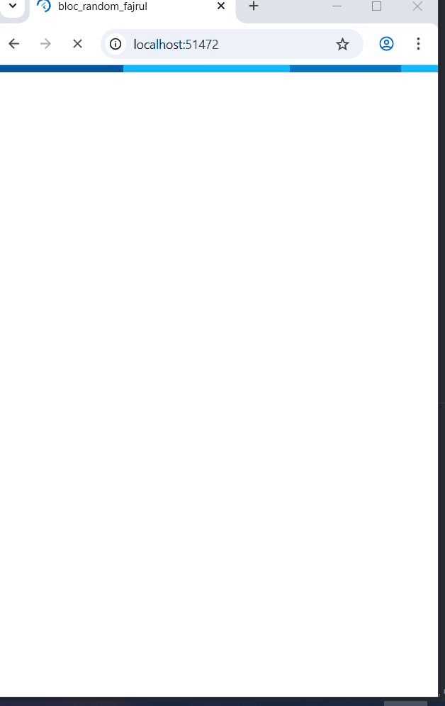

# bloc_random_fajrul

## Langkah 1: Buat Project baru
Buatlah sebuah project flutter baru dengan nama bloc_random_nama (beri nama panggilan Anda) di folder week-12/src/ repository GitHub Anda. Lalu buat file baru di folder lib dengan nama random_bloc.dart
## JAWABAN
 

## Langkah 2: Isi kode random_bloc.dart
### 💻 Source Code  
```dart
 import 'dart:async';
import 'dart:math';
```

---


## Langkah 3: Buat class RandomNumberBloc()
### 💻 Source Code  
```dart
class RandomNumberBloc {

}
```

---

## Langkah 4: Buat variabel StreamController
Di dalam class RandomNumberBloc() ketik variabel berikut ini
### 💻 Source Code  
```dart
// StreamController for input events
final _generateRandomController = StreamController<void>();
// StreamController for output
final _randomNumberController = StreamController<int>();

// Input Sink
Sink<void> get generateRandom => _generateRandomController.sink;
// Output Stream
Stream<int> get randomNumber => _randomNumberController.stream;
```

---

## Langkah 5: Buat constructor
### 💻 Source Code  
```dart
RandomNumberBloc() {
  _generateRandomController.stream.listen((_) {
    final random = Random().nextInt(10);
    _randomNumberController.sink.add(random);
  });
}
```

---


## Langkah 6: Buat method dispose()


## Langkah 7: Edit main.dart
### 💻 Source Code  
```dart
class MyApp extends StatelessWidget {
  const MyApp({super.key});

  @override
  Widget build(BuildContext context) {
    return MaterialApp(
      title: 'Flutter Demo',
      theme: ThemeData(
        primarySwatch: Colors.blue,
      ),
      home: const RandomScreen(),
    );
  }
}
```

---


## Langkah 8: Buat file baru random_screen.dart
Di dalam folder lib project Anda, buatlah file baru ini. 


## Langkah 9: Lakukan impor material dan random_bloc.dart
Ketik kode ini di file baru random_screen.dart 


### 💻 Source Code  
```dart
import 'package:flutter/material.dart';
import 'random_bloc.dart';
```

---


## Langkah 10: Buat StatefulWidget RandomScreen
Buatlah di dalam file random_screen.dart 


## Langkah 11: Buat variabel
Ketik kode ini di dalam class _RandomScreenState 
### 💻 Source Code  
```dart
final _bloc = RandomNumberBloc();
```

---


## Langkah 12: Buat method dispose()
Ketik kode ini di dalam class _StreamHomePageState 
### 💻 Source Code  
```dart
@override
void dispose() {
  _bloc.dispose();
  super.dispose();
}
```

---

## Langkah 13: Edit method build()
Ketik kode ini di dalam class _StreamHomePageState 
### 💻 Source Code  
```dart
@override
Widget build(BuildContext context) {
  return Scaffold(
    appBar: AppBar(title: const Text('Random Number')),
    body: Center(
      child: StreamBuilder<int>(
        stream: _bloc.randomNumber,
        initialData: 0,
        builder: (context, snapshot) {
          return Text(
            'Random Number: ${snapshot.data}',
            style: const TextStyle(fontSize: 24),
          );
        },
      ),
    ),
    floatingActionButton: FloatingActionButton(
      onPressed: () => _bloc.generateRandom.add(null),
      child: const Icon(Icons.refresh),
    ),
  );
}
```

---

Soal 13
## Jelaskan maksud praktikum ini ! Dimanakah letak konsep pola BLoC-nya ?
Praktikum ini bertujuan untuk memperkenalkan bagaimana cara memisahkan logika bisnis dari tampilan UI menggunakan pola BLoC (Business Logic Component).
Dengan pola ini:

UI tidak lagi memproses data langsung.

Semua logika dihitung di dalam BLoC, lalu UI hanya mendengarkan Stream.

Data yang berubah otomatis memperbarui tampilan tanpa perlu memanggil setState() secara manual.
## Capture hasil praktikum Anda berupa GIF dan lampirkan di README.
## JAWABAN
 
## Lalu lakukan commit dengan pesan "W12: Jawaban Soal 13".
 

