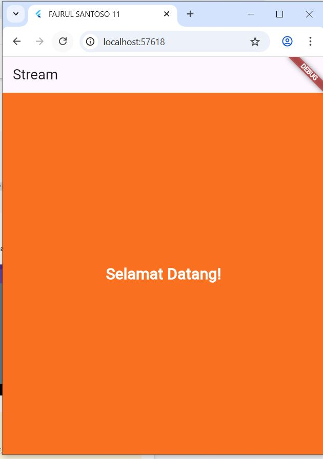
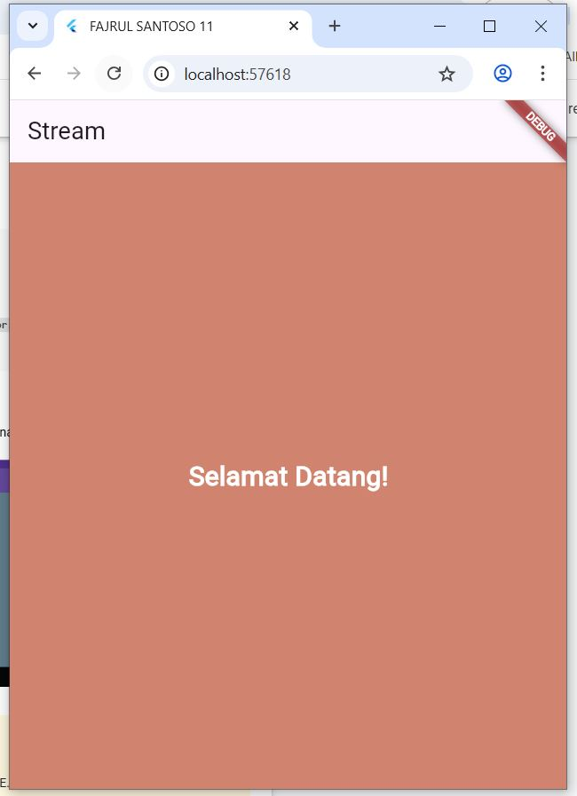
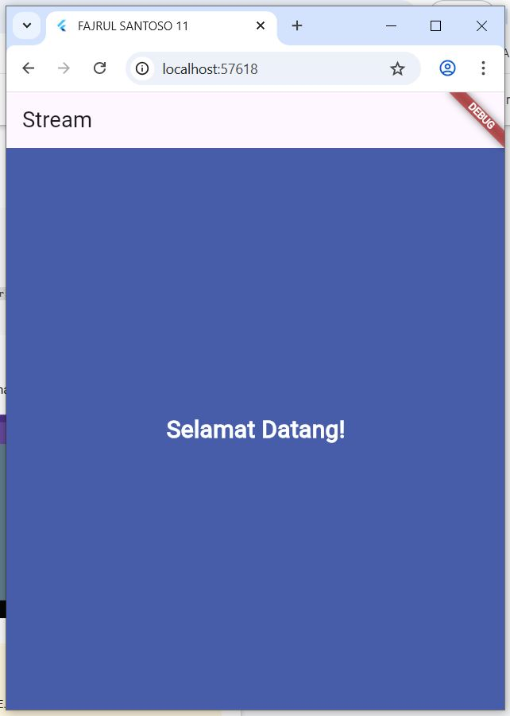
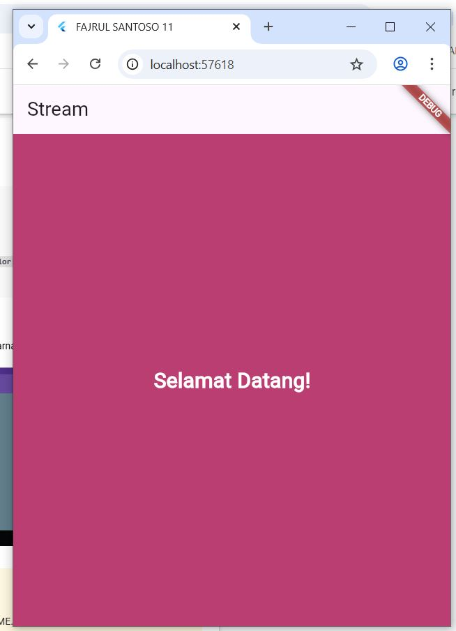

# stream_fajrul

## Langkah 1: Buat Project Baru
Buatlah sebuah project flutter baru dengan nama stream_nama (beri nama panggilan Anda) di folder week-12/src/ repository GitHub Anda.

## Langkah 2: Buka file main.dart
Ketiklah kode seperti berikut ini.
### 💻 Source Code  
```dart
import 'package:flutter/material.dart';

void main() {
  runApp(const MyApp());
}

class MyApp extends StatelessWidget {
  const MyApp({super.key});

  @override
  Widget build(BuildContext context) {
    return MaterialApp(
      title: 'Stream',
      theme: ThemeData(
        primarySwatch: Colors.deepPurple,
      ),
      home: const StreamHomePage(),
    );
  }
}

class StreamHomePage extends StatefulWidget {
  const StreamHomePage({super.key});

  @override
  State<StreamHomePage> createState() => _StreamHomePageState();
}

class _StreamHomePageState extends State<StreamHomePage> {
  @override
  Widget build(BuildContext context) {
    return Container();
  }
}
```

---
## JAWABAN
 

## 1 Tambahkan nama panggilan Anda pada title app sebagai identitas hasil pekerjaan Anda. 
### 💻 Source Code  
```dart
 @override
  Widget build(BuildContext context) {
    return MaterialApp(
      title: 'FAJRUL SANTOSO 11',
      theme: ThemeData(primarySwatch: Colors.deepPurple),
      home: const StreamHomePage(),
    );
  }
}

```

---
## 2 Gantilah warna tema aplikasi sesuai kesukaan Anda.
## 3 Lakukan commit hasil jawaban Soal 1 dengan pesan "W12: Jawaban Soal 1" 


## Langkah 3: Buat file baru stream.dart
Buat file baru di folder lib project Anda. Lalu isi dengan kode berikut.
### 💻 Source Code  
```dart
import 'package:flutter/material.dart';

class ColorStream {

}
```

--- 

## Langkah 4: Tambah variabel colors
Tambahkan variabel di dalam class ColorStream seperti berikut.
### 💻 Source Code  
```dart
 final List<Color> colors = [
       Colors.blueGrey,
    Colors.amber,
    Colors.deepPurple,
    Colors.lightBlue,
    Colors.teal,
    // Tambahan 5 warna favorit
    Colors.redAccent,
    Colors.greenAccent,
    Colors.orange,
    Colors.pink,
    Colors.indigo,
  ];
```

--- 

Soal 2
## 1Tambahkan 5 warna lainnya sesuai keinginan Anda pada variabel colors tersebut.
## 2 Lakukan commit hasil jawaban Soal 2 dengan pesan "W12: Jawaban Soal 2"


## Langkah 5: Tambah method getColors()
Di dalam class ColorStream ketik method seperti kode berikut. Perhatikan tanda bintang di akhir keyword async* (ini digunakan untuk melakukan Stream data) 
### 💻 Source Code  
```dart
 Stream<Color> getColorStream() async* {
}
```

--- 


## Langkah 6: Tambah perintah yield*
Tambahkan kode berikut ini. 
### 💻 Source Code  
```dart
Stream<Color> getColorStream() async* {
    yield* Stream.periodic(
  const Duration(seconds: 1), 
  (int t) {
    int index = t % colors.length;
    return colors[index];
  }
);
}

```

--- 


Soal 3
## Jelaskan fungsi keyword yield* pada kode tersebut! 
yield* digunakan di dalam fungsi generator asinkron (async*) untuk menghasilkan (mengalirkan) semua nilai dari stream lain secara berurutan.
Artinya, yield* akan “meneruskan” seluruh data dari stream yang disebutkan setelahnya ke stream utama.
## Apa maksud isi perintah kode tersebut? 
Stream.periodic(Duration(seconds: 1), ...) membuat stream yang mengeluarkan data setiap 1 detik.=
Setiap kali stream memancarkan nilai baru (t), kode menghitung index = t % colors.length → agar urutan warna berulang terus dari awal setelah mencapai akhir daftar.
return colors[index]; mengembalikan warna berikutnya dari daftar colors.
yield* digunakan untuk mengalirkan semua warna tersebut ke stream utama (getColorStream()).
➡️ Hasilnya: setiap 1 detik, stream ini akan mengeluarkan satu warna dari daftar, berputar terus menerus.
## Lakukan commit hasil jawaban Soal 3 dengan pesan "W12: Jawaban Soal 3" 


## Langkah 7: Buka main.dart
Ketik kode impor file ini pada file main.dart 
### 💻 Source Code  
```dart
import 'stream.dart';

```

## Langkah 8: Tambah variabel
Ketik dua properti ini di dalam class _StreamHomePageState  

### 💻 Source Code  
```dart
Color bgColor = Colors.blueGrey;
late ColorStream colorStream;
```

--- 


## Langkah 9: Tambah method changeColor()
Tetap di file main, Ketik kode seperti berikut 

### 💻 Source Code  
```dart
void changeColor() async {
  await for (var eventColor in colorStream.getColors()) {
    setState(() {
      bgColor = eventColor;
    });
  }
}
```

--- 


## Langkah 10: Lakukan override initState()
Ketika kode seperti berikut  


### 💻 Source Code  
```dart
@override
void initState() {
  super.initState();
  colorStream = ColorStream();
  changeColor();
}
```

---    


## Langkah 11: Ubah isi Scaffold()
Sesuaikan kode seperti berikut. 


### 💻 Source Code  
```dart
return Scaffold(
  appBar: AppBar(
    title: const Text('Stream'),
  ),
  body: Container(
    decoration: BoxDecoration(color: bgColor),
  ),
);
```

---     


Soal 4
## Capture hasil praktikum Anda berupa GIF dan lampirkan di README.
## Lakukan commit hasil jawaban Soal 4 dengan pesan "W12: Jawaban Soal 4" 
## JAWABAN  

 
 

 
 


## Langkah 13: Ganti isi method changeColor()
Anda boleh comment atau hapus kode sebelumnya, lalu ketika kode seperti berikut. 

### 💻 Source Code  
```dart
colorStream.getColors().listen((eventColor) {
  setState(() {
    bgColor = eventColor;
  });
}); 
```

---     

## Soal 5
## Jelaskan perbedaan menggunakan listen dan await for (langkah 9) ! 
Perbedaan await for dan listen pada Stream

await for

Menunggu tiap event satu per satu sebelum lanjut ke event berikutnya.

Digunakan di fungsi async.

Cocok untuk logika berurutan.

listen

Menjalankan callback langsung setiap event muncul, lebih reaktif.

Bisa pause, resume, atau cancel.

Cocok untuk UI atau event-driven programming.

Intinya:
await for = tunggu dulu → baru lanjut.
listen = jalankan segera tiap event, tanpa menunggu.
## Lakukan commit hasil jawaban Soal 5 dengan pesan "W12: Jawaban Soal 5"


## 4. Praktikum 2: Stream controllers dan sinks
StreamControllers akan membuat jembatan antara Stream dan Sink. Stream berisi data secara sekuensial yang dapat diterima oleh subscriber manapun, sedangkan Sink digunakan untuk mengisi (injeksi) data.

Secara sederhana, StreamControllers merupakan stream management. Ia akan otomatis membuat stream dan sink serta beberapa method untuk melakukan kontrol terhadap event dan fitur-fitur yang ada di dalamnya.

Anda dapat membayangkan stream sebagai pipa air yang mengalir searah, dari salah satu ujung Anda dapat mengisi data dan dari ujung lain data itu keluar. Anda dapat melihat konsep stream pada gambar diagram berikut ini. 

## Langkah 1: Buka file stream.dart
Lakukan impor dengan mengetik kode ini.
### 💻 Source Code  
```dart
import 'dart:async';

```

---     

##  Langkah 2: Tambah class NumberStream 🔢
Tetap di file stream.dart, tambah class baru seperti berikut

### 💻 Source Code  
```dart
class NumberStream {
}
```

---     

## Langkah 3: Tambah StreamController ⚙️
Di dalam class NumberStream, buatlah variabel seperti berikut.
### 💻 Source Code  
```dart
final StreamController<int> controller = StreamController<int>();
```

---     

## Langkah 4: Tambah method addNumberToSink
Tetap di class NumberStream buatlah method ini
### 💻 Source Code  
```dart
void addNumberToSink(int newNumber) {
  controller.sink.add(newNumber);
} 
```

---     


## Langkah 5: Tambah method close() 
### 💻 Source Code  
```dart
void close() {
  controller.close();
}
```

---   

## Langkah 6: Buka main.dart
Ketik kode import seperti berikut
### 💻 Source Code  
```dart
import 'dart:async';
import 'dart:math';
```

---   

## Langkah 7: Tambah variabel
Di dalam class _StreamHomePageState ketik variabel berikut
### 💻 Source Code  
```dart
int lastNumber = 0;
late StreamController numberStreamController;
late NumberStream numberStream;
```

---   

## Langkah 8: Edit initState() 
### 💻 Source Code  
```dart
@override
void initState() {
  numberStream = NumberStream();
  numberStreamController = numberStream.controller;
  Stream stream = numberStreamController.stream;
  stream.listen((event) {
    setState(() {
      lastNumber = event;
    });
  });
  super.initState();
}
```

---   

## Langkah 9: Edit dispose()
### 💻 Source Code  
```dart
@override
void dispose() {
  numberStreamController.close();
  super.dispose();
}
```

---   

## Langkah 10: Tambah method addRandomNumber()
### 💻 Source Code  
```dart
void addRandomNumber() {
  Random random = Random();
  int myNum = random.nextInt(10);
  numberStream.addNumberToSink(myNum);
}
```

---   

## Langkah 11: Edit method build()
### 💻 Source Code  
```dart
body: SizedBox(
  width: double.infinity,
  child: Column(
    mainAxisAlignment: MainAxisAlignment.spaceEvenly,
    crossAxisAlignment: CrossAxisAlignment.center,
    children: [
      Text(lastNumber.toString()),
      ElevatedButton(
        onPressed: () => addRandomNumber(),
        child: Text('New Random Number'),
      ),
    ],
  ),
),
```

---   


## Jelaskan maksud kode langkah 8 dan 10 tersebut! 
Pada langkah ini, program menghasilkan angka random kemudian angka tersebut dimasukkan ke sink stream. Setelah dikirim, stream langsung meneruskan data itu ke listener yang akan menampilkan angka terbaru di layar.

Intinya: Langkah 8 = Mengirim data baru ke stream supaya UI otomatis berubah.
Langkah 10 adalah menutup stream.
Stream yang sudah tidak digunakan harus ditutup untuk mencegah kebocoran memori dan agar aplikasi tetap ringan. Ini dilakukan saat halaman atau widget ditutup.

Intinya: Langkah 10 = Membersihkan resource dengan menutup stream.
## Capture hasil praktikum Anda berupa GIF dan lampirkan di README.

## Lalu lakukan commit dengan pesan "W12: Jawaban Soal 6".
 


