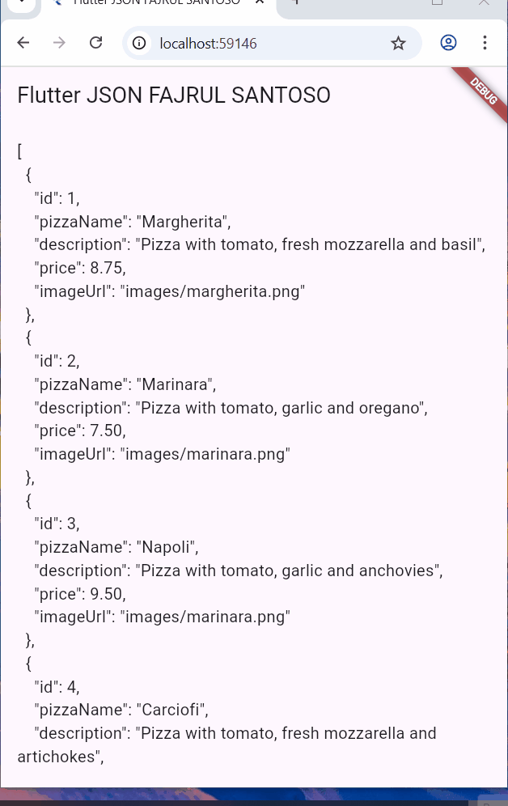

# store_data_fajrulking

## Langkah 1: Buat Project Baru
Buatlah sebuah project flutter baru dengan nama store_data_nama (beri nama panggilan Anda) di folder week-13/src/ repository GitHub Anda.


## Langkah 2: Buka file main.dart
Ketiklah kode seperti berikut ini.

### 💻 Source Code  
```dart
import 'package:flutter/material.dart';

void main() {
  runApp(const MyApp());
}

class MyApp extends StatelessWidget {
  const MyApp({super.key});

  // This widget is the root of your application.
  @override
  Widget build(BuildContext context) {
    return MaterialApp(
      title: 'Flutter JSON Demo',
      theme: ThemeData(
        primarySwatch: Colors.blue,
      ),
      home: const MyHomePage(),
    );
  }
}

class MyHomePage extends StatefulWidget {
  const MyHomePage({super.key});

  @override
  State<MyHomePage> createState() => _MyHomePageState();
}

class _MyHomePageState extends State<MyHomePage> {
  @override
  Widget build(BuildContext context) {
    return Scaffold(
      appBar: AppBar(title: const Text('JSON')),
      body: Container(),
    );
  }
}
```

---

Soal 1
## Tambahkan nama panggilan Anda pada title app sebagai identitas hasil pekerjaan Anda.
## Gantilah warna tema aplikasi sesuai kesukaan Anda.
## Lakukan commit hasil jawaban Soal 1 dengan pesan "W13: Jawaban Soal 1"


## Langkah 3: Buat folder baru assets
Buat folder baru assets di root project Anda


## Langkah 4: Buat file baru pizzalist.json
Letakkan file ini di dalam folder assets, lalu salin data JSON berikut ke file tersebut.

### 💻 Source Code  
```dart
[
  {
    "id": 1,
    "pizzaName": "Margherita",
    "description": "Pizza with tomato, fresh mozzarella and basil",
    "price": 8.75,
    "imageUrl": "images/margherita.png"
  },
  {
    "id": 2,
    "pizzaName": "Marinara",
    "description": "Pizza with tomato, garlic and oregano",
    "price": 7.50,
    "imageUrl": "images/marinara.png"
  },
  {
    "id": 3,
    "pizzaName": "Napoli",
    "description": "Pizza with tomato, garlic and anchovies",
    "price": 9.50,
    "imageUrl": "images/marinara.png"
  },
  {
    "id": 4,
    "pizzaName": "Carciofi",
    "description": "Pizza with tomato, fresh mozzarella and artichokes",
    "price": 8.80,
    "imageUrl": "images/marinara.png"
  },
  {
    "id": 5,
    "pizzaName": "Bufala",
    "description": "Pizza with tomato, buffalo mozzarella and basil",
    "price": 12.50,
    "imageUrl": "images/marinara.png"
  }
]
```

---

## Langkah 5: Edit pubspec.yaml
Tambahkan referensi folder assets ke file pubspec.yaml seperti berikut ini. 
### 💻 Source Code  
```dart
assets:
  - assets/
```

---


## Langkah 6: Edit maint.dart
Buatlah variabel seperti berikut ini class _MyHomePageState.
### 💻 Source Code  
```dart
class _MyHomePageState extends State<MyHomePage> {
  String pizzaString = ''; // Tambahkan baris ini
  
  @override
  Widget build(BuildContext context) {
```

---

## Langkah 7: Tetap di main.dart
Untuk membaca isi dari file pizzalist.json di dalam class _MyHomePageState, tambahkan method readJsonFile seperti kode berikut untuk membaca file json.
### 💻 Source Code  
```dart
class _MyHomePageState extends State<MyHomePage> {
  String pizzaString = '';

  // Tambahkan method ini
  Future readJsonFile() async {
    String myString = await DefaultAssetBundle.of(context)
        .loadString('assets/pizzalist.json');
    setState(() {
      pizzaString = myString;
    });
  }

  // 
```

---

## Langkah 8: Panggil method readJsonFile
Panggil method readJsonFile di initState 
### 💻 Source Code  
```dart
class _MyHomePageState extends State<MyHomePage> {
  String pizzaString = '';

  @override
  void initState() {
    super.initState();
    readJsonFile(); // Panggil method di sini
  }
  
  
```

---


## Langkah 9: Tampilkan hasil JSON
Kemudian tampilkan hasil JSON di body scaffold.

### 💻 Source Code  
```dart
body: text(pizzastring)
  
```

---  

## Soal 2
## Masukkan hasil capture layar ke laporan praktikum Anda.
## Lakukan commit hasil jawaban Soal 2 dengan pesan "W13: Jawaban Soal 2"

## JAWABAN
  


## Langkah 11: Buat file baru pizza.dart
Kita ingin mengubah data json tersebut dari String menjadi objek List. Maka perlu membuat file class baru di folder lib/model dengan nama file pizza.dart. 

### 💻 Source Code  
```dart
class Pizza {
  final int id;
  final String pizzaName;
  final String description;
  final double price;
  final String imageUrl;
}
  
```

---  

## Langkah 13: Buat constructor()
Di dalam class Pizza definisikan constructor fromJson, yang mana akan mengambil data berupa Map sebagai parameter dan mengubah Map ke objek Pizza seperti kode berikut: 

### 💻 Source Code  
```dart
Pizza.fromJson(Map<String, dynamic> json) :
    id = json['id'],
    pizzaName = json['pizzaname'],
    description = json['description'],
    price = json['price'],
    imageUrl = json['imageUrl'];
  
```

---  


## Langkah 14: Pindah ke class _MyHomePageState
Tambahkan kode jsonDecode seperti berikut.
### 💻 Source Code  
```dart
Future readJsonFromFile() async {
  String myString = await DefaultAssetBundle.of(context)
    .loadString('assets/pizzalist.json');
  List pizzaMapList = jsonDecode(myString);
  ...
}
  
```

---  

## Langkah 15: Pastikan impor class
Perhatikan pada bagian atas file bahwa telah berhasil impor kedua file berikut. 

### 💻 Source Code  
```dart
import 'dart:convert';
import './pizza.dart';  
```
 
---  

## Langkah 16: Konversi List Map ke List Objek Dart
Di dalam method readJsonFile(), setelah baris List pizzaMapList = jsonDecode(myString);, tambahkan kode berikut untuk mengonversi setiap Map di pizzaMapList menjadi objek Pizza dan menyimpannya ke myPizzas.

### 💻 Source Code  
```dart
List<Pizza> myPizzas = [];
  for (var pizza in pizzaMapList) {
    Pizza myPizza = Pizza.fromJson(pizza);
    myPizzas.add(myPizza);
  }
```
 
---  

## Langkah 17: return myPizzas
Hapus atau komentari setState yang menampilkan pizzaString dari Langkah 7. Kemudian, kembalikan myPizzas.  

### 💻 Source Code  
```dart
return myPizzas;
```
 
---  


## Langkah 18: Perbarui Signature Method
Perbarui signature method readJsonFile() untuk secara eksplisit menunjukkan bahwa ia mengembalikan Future yang berisi List.
### 💻 Source Code  
```dart
Future<List<Pizza>> readJsonFromFile() async {
```
 
---  


## Langkah 19: Deklarasikan Variabel State
Di dalam class _MyHomePageState, deklarasikan variabel state baru untuk menampung List objek Pizza. 
### 💻 Source Code  
```dart
List<Pizza> myPizzas = [];
```
 
---  

## Langkah 20: Panggil di initState dan Perbarui State
Perbarui method initState() di _MyHomePageState untuk memanggil readJsonFile(). Karena readJsonFile() mengembalikan Future, gunakan .then() untuk mendapatkan hasilnya, dan perbarui state myPizzas. 

### 💻 Source Code  
```dart
@override
  void initState() {
    super.initState();
    readJsonFromFile().then((value) {
      setState(() {
        myPizzas = value;
      });
    });
  }
```
 
---  

## Langkah 21: Tampilkan Data di ListView
Perbarui body dari Scaffold untuk menggunakan ListView.builder yang menampilkan pizzaName sebagai judul dan description sebagai subjudul dari setiap objek Pizza. 
### 💻 Source Code  
```dart
body: ListView.builder(
  itemCount: myPizzas.length,
  itemBuilder: (context, index) {
    return ListTile(
      title: Text(myPizzas[index].pizzaName),
      subtitle: Text(myPizzas[index].description),
    );
  },
 ));
}
```
 
---  


## Langkah 22: Run
Jalankan aplikasi. Sekarang, Anda akan melihat data pizza ditampilkan dalam daftar yang lebih terstruktur sebagai objek List Dart.

## soal 3
## Masukkan hasil capture layar ke laporan praktikum Anda.
## Lakukan commit hasil jawaban Soal 2 dengan pesan "W13: Jawaban Soal 3"
