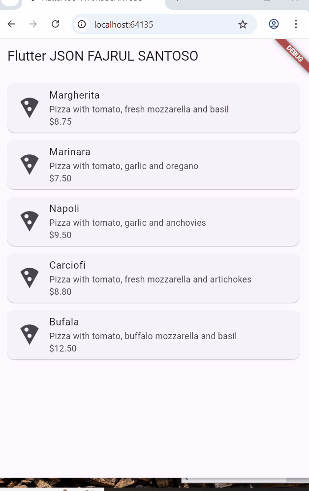
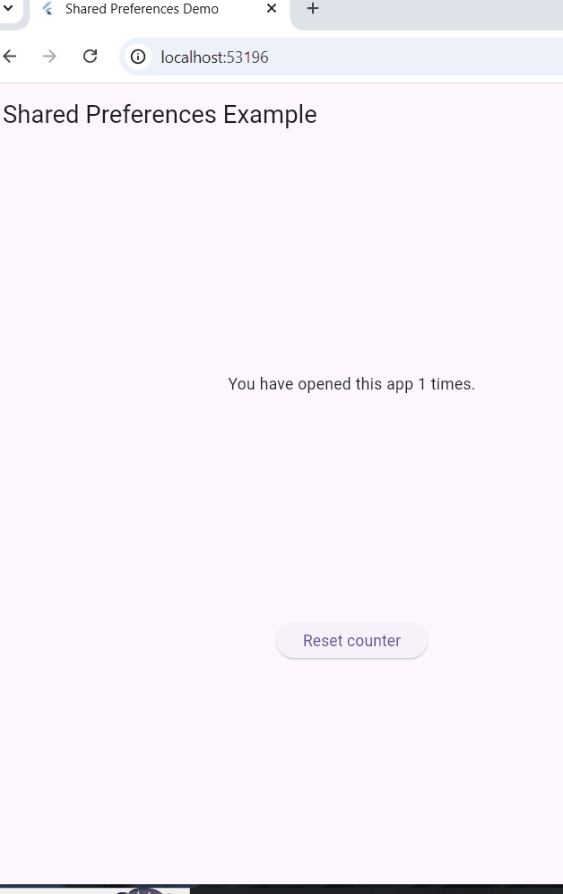
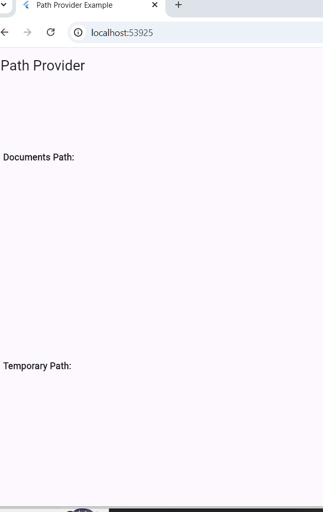

## Langkah 1: Buat Project Baru
Buatlah sebuah project flutter baru dengan nama store_data_nama (beri nama panggilan Anda) di folder week-13/src/ repository GitHub Anda.


## Langkah 2: Buka file main.dart
Ketiklah kode seperti berikut ini.

### 💻 Source Code  
```dart
import 'package:flutter/material.dart';

void main() {
  runApp(const MyApp());
}

class MyApp extends StatelessWidget {
  const MyApp({super.key});

  // This widget is the root of your application.
  @override
  Widget build(BuildContext context) {
    return MaterialApp(
      title: 'Flutter JSON Demo',
      theme: ThemeData(
        primarySwatch: Colors.blue,
      ),
      home: const MyHomePage(),
    );
  }
}

class MyHomePage extends StatefulWidget {
  const MyHomePage({super.key});

  @override
  State<MyHomePage> createState() => _MyHomePageState();
}

class _MyHomePageState extends State<MyHomePage> {
  @override
  Widget build(BuildContext context) {
    return Scaffold(
      appBar: AppBar(title: const Text('JSON')),
      body: Container(),
    );
  }
}
```

---

Soal 1
## Tambahkan nama panggilan Anda pada title app sebagai identitas hasil pekerjaan Anda.
## Gantilah warna tema aplikasi sesuai kesukaan Anda.
## Lakukan commit hasil jawaban Soal 1 dengan pesan "W13: Jawaban Soal 1"


## Langkah 3: Buat folder baru assets
Buat folder baru assets di root project Anda


## Langkah 4: Buat file baru pizzalist.json
Letakkan file ini di dalam folder assets, lalu salin data JSON berikut ke file tersebut.

### 💻 Source Code  
```dart
[
  {
    "id": 1,
    "pizzaName": "Margherita",
    "description": "Pizza with tomato, fresh mozzarella and basil",
    "price": 8.75,
    "imageUrl": "images/margherita.png"
  },
  {
    "id": 2,
    "pizzaName": "Marinara",
    "description": "Pizza with tomato, garlic and oregano",
    "price": 7.50,
    "imageUrl": "images/marinara.png"
  },
  {
    "id": 3,
    "pizzaName": "Napoli",
    "description": "Pizza with tomato, garlic and anchovies",
    "price": 9.50,
    "imageUrl": "images/marinara.png"
  },
  {
    "id": 4,
    "pizzaName": "Carciofi",
    "description": "Pizza with tomato, fresh mozzarella and artichokes",
    "price": 8.80,
    "imageUrl": "images/marinara.png"
  },
  {
    "id": 5,
    "pizzaName": "Bufala",
    "description": "Pizza with tomato, buffalo mozzarella and basil",
    "price": 12.50,
    "imageUrl": "images/marinara.png"
  }
]
```

---

## Langkah 5: Edit pubspec.yaml
Tambahkan referensi folder assets ke file pubspec.yaml seperti berikut ini. 
### 💻 Source Code  
```dart
assets:
  - assets/
```

---


## Langkah 6: Edit maint.dart
Buatlah variabel seperti berikut ini class _MyHomePageState.
### 💻 Source Code  
```dart
class _MyHomePageState extends State<MyHomePage> {
  String pizzaString = ''; // Tambahkan baris ini
  
  @override
  Widget build(BuildContext context) {
```

---

## Langkah 7: Tetap di main.dart
Untuk membaca isi dari file pizzalist.json di dalam class _MyHomePageState, tambahkan method readJsonFile seperti kode berikut untuk membaca file json.
### 💻 Source Code  
```dart
class _MyHomePageState extends State<MyHomePage> {
  String pizzaString = '';

  // Tambahkan method ini
  Future readJsonFile() async {
    String myString = await DefaultAssetBundle.of(context)
        .loadString('assets/pizzalist.json');
    setState(() {
      pizzaString = myString;
    });
  }

  // 
```

---

## Langkah 8: Panggil method readJsonFile
Panggil method readJsonFile di initState 
### 💻 Source Code  
```dart
class _MyHomePageState extends State<MyHomePage> {
  String pizzaString = '';

  @override
  void initState() {
    super.initState();
    readJsonFile(); // Panggil method di sini
  }
  
  
```

---


## Langkah 9: Tampilkan hasil JSON
Kemudian tampilkan hasil JSON di body scaffold.

### 💻 Source Code  
```dart
body: text(pizzastring)
  
```

---  

## Soal 2
## Masukkan hasil capture layar ke laporan praktikum Anda.
## Lakukan commit hasil jawaban Soal 2 dengan pesan "W13: Jawaban Soal 2"

## JAWABAN
  


## Langkah 11: Buat file baru pizza.dart
Kita ingin mengubah data json tersebut dari String menjadi objek List. Maka perlu membuat file class baru di folder lib/model dengan nama file pizza.dart. 

### 💻 Source Code  
```dart
class Pizza {
  final int id;
  final String pizzaName;
  final String description;
  final double price;
  final String imageUrl;
}
  
```

---  

## Langkah 13: Buat constructor()
Di dalam class Pizza definisikan constructor fromJson, yang mana akan mengambil data berupa Map sebagai parameter dan mengubah Map ke objek Pizza seperti kode berikut: 

### 💻 Source Code  
```dart
Pizza.fromJson(Map<String, dynamic> json) :
    id = json['id'],
    pizzaName = json['pizzaname'],
    description = json['description'],
    price = json['price'],
    imageUrl = json['imageUrl'];
  
```

---  


## Langkah 14: Pindah ke class _MyHomePageState
Tambahkan kode jsonDecode seperti berikut.
### 💻 Source Code  
```dart
Future readJsonFromFile() async {
  String myString = await DefaultAssetBundle.of(context)
    .loadString('assets/pizzalist.json');
  List pizzaMapList = jsonDecode(myString);
  ...
}
  
```

---  

## Langkah 15: Pastikan impor class
Perhatikan pada bagian atas file bahwa telah berhasil impor kedua file berikut. 

### 💻 Source Code  
```dart
import 'dart:convert';
import './pizza.dart';  
```
 
---  

## Langkah 16: Konversi List Map ke List Objek Dart
Di dalam method readJsonFile(), setelah baris List pizzaMapList = jsonDecode(myString);, tambahkan kode berikut untuk mengonversi setiap Map di pizzaMapList menjadi objek Pizza dan menyimpannya ke myPizzas.

### 💻 Source Code  
```dart
List<Pizza> myPizzas = [];
  for (var pizza in pizzaMapList) {
    Pizza myPizza = Pizza.fromJson(pizza);
    myPizzas.add(myPizza);
  }
```
 
---  

## Langkah 17: return myPizzas
Hapus atau komentari setState yang menampilkan pizzaString dari Langkah 7. Kemudian, kembalikan myPizzas.  

### 💻 Source Code  
```dart
return myPizzas;
```
 
---  


## Langkah 18: Perbarui Signature Method
Perbarui signature method readJsonFile() untuk secara eksplisit menunjukkan bahwa ia mengembalikan Future yang berisi List.
### 💻 Source Code  
```dart
Future<List<Pizza>> readJsonFromFile() async {
```
 
---  


## Langkah 19: Deklarasikan Variabel State
Di dalam class _MyHomePageState, deklarasikan variabel state baru untuk menampung List objek Pizza. 
### 💻 Source Code  
```dart
List<Pizza> myPizzas = [];
```
 
---  

## Langkah 20: Panggil di initState dan Perbarui State
Perbarui method initState() di _MyHomePageState untuk memanggil readJsonFile(). Karena readJsonFile() mengembalikan Future, gunakan .then() untuk mendapatkan hasilnya, dan perbarui state myPizzas. 

### 💻 Source Code  
```dart
@override
  void initState() {
    super.initState();
    readJsonFromFile().then((value) {
      setState(() {
        myPizzas = value;
      });
    });
  }
```
 
---  

## Langkah 21: Tampilkan Data di ListView
Perbarui body dari Scaffold untuk menggunakan ListView.builder yang menampilkan pizzaName sebagai judul dan description sebagai subjudul dari setiap objek Pizza. 
### 💻 Source Code  
```dart
body: ListView.builder(
  itemCount: myPizzas.length,
  itemBuilder: (context, index) {
    return ListTile(
      title: Text(myPizzas[index].pizzaName),
      subtitle: Text(myPizzas[index].description),
    );
  },
 ));
}
```
 
---  


## Langkah 22: Run
Jalankan aplikasi. Sekarang, Anda akan melihat data pizza ditampilkan dalam daftar yang lebih terstruktur sebagai objek List Dart.

## soal 3
## Masukkan hasil capture layar ke laporan praktikum Anda.
## Lakukan commit hasil jawaban Soal 2 dengan pesan "W13: Jawaban Soal 3" 
## JAWABAN
   


## Langkah 23: Tambahkan Method toJson() (Serialization)
Di file pizza.dart, tambahkan method toJson() ke class Pizza. Method ini berfungsi untuk mengonversi objek Dart kembali menjadi Map (langkah pertama menuju JSON String). 
### 💻 Source Code  
```dart
Map<String, dynamic> toJson() {
    return {
      'id': id,
      'pizzaName': pizzaName,
      'description': description,
      'price': price,
      'imageUrl': imageUrl,
    };
  }
```
 
---  


## Langkah 24: Buat Fungsi Konversi JSON String
Di main.dart, tambahkan fungsi convertToJSON di dalam _MyHomePageState untuk menggunakan jsonEncode (dari dart:convert) yang mengubah List objek Dart menjadi JSON String.

### 💻 Source Code  
```dart
String convertToJson(List<Pizza> pizzas) {
    return jsonEncode(pizzas.map((pizza) => pizza.toJson()).toList());
  }
```
 
---  

## Langkah 25: Tampilkan Output JSON di Konsol
Di method readJsonFile(), tambahkan kode untuk memanggil convertToJSON dan mencetak hasilnya ke Debug Console sebelum mengembalikan myPizzas.


### 💻 Source Code  
```dart
String json = convertToJson(myPizzas);
  print(json);
  return myPizzas;
```
 
---   


## 4. Praktikum 2: Handle kompatibilitas data JSON
Setelah Anda menyelesaikan praktikum 1, Anda dapat melanjutkan praktikum 2 ini. Selesaikan langkah-langkah praktikum berikut ini menggunakan editor Visual Studio Code (VS Code) atau Android Studio atau code editor lain kesukaan Anda. Jawablah di laporan praktikum Anda pada setiap soal yang ada di beberapa langkah praktikum ini.


## Langkah 1: Simulasikan Error
Anggaplah Anda telah mengganti file pizzalist.json dengan data yang tidak konsisten.

## Langkah 2: Lihat Error Tipe Data String ke Int
Jika ID pizza di JSON dikirim sebagai String (misalnya "id": "1" di JSON) sementara model Dart mengharapkan int, Anda akan melihat runtime error.

### 💻 Source Code  
```dart
16  Pizza.fromJson(Map<String, dynamic> json) {
17    this.id = json['id'];
  }
// ...
// Exception has occurred.
// _TypeError (type 'String' is not a subtype of type 'int')

```
 
---   


## Langkah 3: Terapkan tryParse dan Null Coalescing pada ID
Di Pizza.fromJson (file pizza.dart), ganti cara mendapatkan nilai id menggunakan int.tryParse dan null coalescing operator (??) untuk memberikan nilai default 0 jika parsing gagal atau nilainya null. Tujuannya adalah memastikan nilai id selalu integer.

### 💻 Source Code  
```dart
id = int.tryParse(json['id'].toString()) ?? 0;
)
```
 
---   


## Langkah 4: Simulasikan Error Null pada String
Jika Anda menjalankan ulang dan ada bidang yang hilang (misalnya imageUrl hilang), Anda mungkin mendapatkan error Null.

### 💻 Source Code  
```dart
Pizza.fromJson(Map<String, dynamic> json) :
    id = int.tryParse(json['id']) ?? 0;
    pizzaName = json['pizzaName'];
    description = json['description'];
    price = json['price'];
    imageUrl = json['imageUrl'];
// ...
// Exception has occurred.
// _TypeError (type 'Null' is not a subtype of type 'String')
```
 
---   


## Langkah 5: Terapkan Null Coalescing pada String
Tambahkan null coalescing operator (??) pada imageUrl untuk memberikan string kosong ('') jika nilai yang diterima adalah null. Lakukan hal yang sama untuk bidang String lainnya seperti pizzaName dan description jika perlu.


### 💻 Source Code  
```dart
imageUrl = json['imageUrl'] ?? '';
```
 
---   


## Langkah 6: Gunakan toString() untuk Field String
Untuk memastikan semua nilai yang digunakan sebagai String benar-benar String (bahkan jika mereka mungkin dikirim sebagai int atau tipe lain), gunakan toString().

### 💻 Source Code  
```dart
Pizza.fromJson(Map<String, dynamic> json) {
  id = json['id'];
  pizzaName = json['pizzaName'].toString();
  description = json['description'].toString();
  price = json['price'];
  imageUrl = json['imageUrl'] ?? '';
}```
 
---   


## Langkah 7: Simulasikan Error Tipe Data String ke Double
Jika Anda menjalankan ulang, Anda mungkin menemukan error saat mengonversi String ke Double untuk bidang price.

### 💻 Source Code  
```dart
26  this.price = json['keyPrice'];
// ...
// Exception has occurred.
// _TypeError (type 'String' is not a subtype of type 'double')
```
 
---   

## Langkah 8: Terapkan double.tryParse
Terapkan double.tryParse dengan null coalescing (?? 0) untuk bidang price, sama seperti yang Anda lakukan pada id.

### 💻 Source Code  
```dart
Pizza.fromJson(Map<String, dynamic> json) :
  id = int.tryParse(json['id'].toString()) ?? 0,
  pizzaName = json['pizzaName'].toString(),
  description = json['description'].toString(),
  price = double.tryParse(json['price'].toString()) ?? 0,
  imageUrl = json['imageUrl'].toString();
}
```
 
---   

## Langkah 9: Run dan Perhatikan Output Null
Setelah mengimplementasikan semua perbaikan tipe data, aplikasi akan berjalan, tetapi mungkin menampilkan "null" di UI jika ada bidang yang hilang atau gagal diparsing (seperti pizzaName atau description).


## Soal 4
Capture hasil running aplikasi Anda, kemudian impor ke laporan praktikum Anda!
Lalu lakukan commit dengan pesan "W13: Jawaban Soal 4".
## JAWABAN
   


## 5. Praktikum 3: Menangani error JSON
Pada praktikum 3 ini, Anda akan berfokus pada Catching common JSON errors, yaitu dengan mengganti string literals (nama kunci JSON) dengan konstanta untuk menghindari error yang sulit di-debug (kesalahan pengetikan).

## Langkah 1: Buka pizza.dart dan Buat Konstanta
Di bagian atas file pizza.dart, di luar class Pizza, deklarasikan konstanta untuk setiap kunci JSON.

### 💻 Source Code  
```dart
const keyId = 'id';
const keyName = 'pizzaName';
const keyDescription = 'description';
const keyPrice = 'price';
const keyImage = 'imageUrl';
```
 
---   


## Langkah 2: Perbarui fromJson() menggunakan Konstanta
Di constructor Pizza.fromJson, ganti semua string literal kunci JSON (misalnya 'id') dengan konstanta yang sesuai (keyId).

### 💻 Source Code  
``Pizza.fromJson(Map<String, dynamic> json) {
  id = int.tryParse(json[keyId].toString()) ?? 0;
  pizzaName =
    json[keyName] != null ? json[keyName].toString() : 'No name';
  description =
    (json[keyDescription] != null) ? json[keyDescription].toString() : '';
  price = double.tryParse(json[keyPrice].toString()) ?? 0;
  imageUrl = json[keyImage] ?? '';
}
```
 
---   


## Langkah 3: Perbarui toJson() menggunakan Konstanta
Perbarui juga method toJson() agar menggunakan konstanta yang sama.


### 💻 Source Code  
```Map<String, dynamic> toJson() {
  return {
    keyId: id,
    keyName: pizzaName,
    keyDescription: description,
    keyPrice: price,
    keyImage: imageUrl,
  };
}
```
 
---   


## Soal 5
## Jelaskan maksud kode lebih safe dan maintainable!
Dengan memakai tryParse, toString(), dan ?? (nilai default), aplikasi tidak akan error jika data JSON salah tipe, kosong, atau hilang.

Semua field diproses secara konsisten sehingga kode lebih stabil, lebih mudah dibaca, dan tetap berjalan meskipun datanya tidak sempurna.
## Capture hasil praktikum Anda dan lampirkan di README.
## Lalu lakukan commit dengan pesan "W13: Jawaban Soal 5". 


## 6. Praktikum 4: SharedPreferences
Praktikum ini membahas menyimpan data sederhana dengan SharedPreferences. Kita akan menggunakan shared_preferences untuk menyimpan hitungan sederhana. 


## Langkah 1: Tambahkan Dependensi
Di Terminal, tambahkan package shared_preferences.

### 💻 Source Code  
```Map<String, dynamic> toJson() {
 flutter pub add shared_preferences
  };
}
```
 
---   


## Langkah 2: Install Dependensi
Jalankan flutter pub get jika editor Anda tidak melakukannya secara otomatis.


## Langkah 3: Lakukan Import
Di file main.dart, tambahkan import untuk shared_preferences.

### 💻 Source Code  
```
import 'package:shared_preferences/shared_preferences.dart';

```
 
---   


## Langkah 4: Tambahkan Variabel appCounter
Di dalam class _MyHomePageState (atau State class yang Anda gunakan), deklarasikan variabel appCounter.

### 💻 Source Code  
```
int appCounter = 0;
```
 
---   


## Langkah 5: Buat Method readAndWritePreference
Buat method asinkron readAndWritePreference().

### 💻 Source Code  
```
Future<void> readAndWritePreference() async {
```
 
---   


## Langkah 6: Dapatkan Instance SharedPreferences
Di dalam method tersebut, dapatkan instance SharedPreferences. Perlu diingat bahwa ini adalah operasi asinkron, jadi gunakan await.

### 💻 Source Code  
```
SharedPreferences prefs = await SharedPreferences.getInstance();
```
 
---   


## Langkah 7: Baca, Cek Null, dan Increment Counter
Baca nilai appCounter dari storage. Gunakan null coalescing (?? 0) untuk memastikan nilai default 0 jika data belum ada. Kemudian increment nilai tersebut.

### 💻 Source Code  
```
appCounter = prefs.getInt('appCounter') ?? 0;
appCounter++;
```
 
---   


## Langkah 8: Simpan Nilai Baru
Simpan nilai appCounter yang sudah di-increment kembali ke storage menggunakan prefs.setInt().

### 💻 Source Code  
```
await prefs.setInt('appCounter', appCounter);
```
 
---   


## Langkah 9: Perbarui State
Panggil setState() untuk memperbarui UI dengan nilai baru appCounter.

### 💻 Source Code  
```
setState(() {
  appCounter = appCounter;
});
```
 
---   


## Langkah 10: Panggil di initState()
Panggil readAndWritePreference() di initState() agar penghitung dibaca saat aplikasi pertama kali dibuka.

### 💻 Source Code  
```
@override
void initState() {
  super.initState();
  readAndWritePreference();
}
```
 
---   


## Langkah 11: Perbarui Tampilan (body)
Ganti body Scaffold Anda dengan tata letak yang menampilkan hitungan dan tombol 'Reset counter'.

### 💻 Source Code  
```
child: Center(
  child: Column(
    mainAxisAlignment: MainAxisAlignment.spaceEvenly,
    children: [
      Text(
        'You have opened the app $appCounter times.',
      ),
      ElevatedButton(
        onPressed: () {},
        child: Text('Reset counter'),
      ),
    ],
  ),
),

```
 
---   


## Langkah 12: Run
Aplikasi sekarang akan menampilkan "You have opened the app 1 times" (jika ini pembukaan pertama).


Langkah 13: Buat Method deletePreference()
Tambahkan method asinkron deletePreference() yang berfungsi untuk menghapus data menggunakan prefs.clear().

### 💻 Source Code  
```
Future<void> deletePreference() async {
  SharedPreferences prefs = await SharedPreferences.getInstance();
  await prefs.clear();
  setState(() {
    appCounter = 0;
  });
}

```
 
---   


Langkah 14: Panggil deletePreference()
Hubungkan deletePreference() ke tombol 'Reset counter'.

### 💻 Source Code  
```
onPressed: () {
  deletePreference();
},
child: Text('Reset counter'),

```
 
---   


Langkah 15: Run
Jalankan aplikasi. Tombol reset sekarang akan berfungsi, menghapus semua pasangan kunci-nilai dan mereset hitungan.


## Soal 6
## Capture hasil praktikum Anda berupa GIF dan lampirkan di README.
Lalu lakukan commit dengan pesan "W13: Jawaban Soal 6". 
## JAWABAN
   


## 7. Praktikum 5: Akses filesystem dengan path_provider
Praktikum ini berfokus untuk mengakses file system menggunakan path_provider untuk menemukan direktori umum (documents dan temp) pada perangkat 

## Langkah 1: Tambahkan Dependensi
Tambahkan package path_provider melalui Terminal.

### 💻 Source Code  
```
flutter pub add path_provider
```
 
---   


## Langkah 2: Lakukan Import
Di file main.dart, tambahkan import untuk path_provider.

### 💻 Source Code  
```
import 'package:path_provider/path_provider.dart';
```
 
---   


## Langkah 3: Tambahkan Variabel Path State
Di State class Anda, tambahkan variabel untuk menyimpan jalur direktori dokumen dan temporer.


### 💻 Source Code  
```
String documentsPath='';
String tempPath='';
```
 
---   


## Langkah 4: Buat Method getPaths()
Buat method asinkron getPaths() yang menggunakan getApplicationDocumentsDirectory() dan getTemporaryDirectory() untuk mengambil jalur sistem file yang tepat, lalu perbarui state.


### 💻 Source Code  
```
Future<void> getPaths() async {
  final docDir = await getApplicationDocumentsDirectory();
  final tempDir = await getTemporaryDirectory();

  setState(() {
    documentsPath = docDir.path;
    tempPath = tempDir.path;
  });
}
```
 
---   


## Langkah 5: Panggil getPaths() di initState()
Panggil getPaths() di initState().

### 💻 Source Code  
```
@override
void initState() {
  super.initState();
  getPaths();
}
```
 
---   


## Langkah 6: Perbarui Tampilan
Perbarui body Scaffold untuk menampilkan kedua jalur yang telah diambil.


### 💻 Source Code  
```
@override
Widget build(BuildContext context) {
  return Scaffold(
    appBar: AppBar(title: const Text('Path Provider')),
    body: Column(
      mainAxisAlignment: MainAxisAlignment.spaceEvenly,
      children: [
        Text('Doc path: $documentsPath'),
        Text('Temp path $tempPath'),
      ],
    ),
  );
}
```
 
---   


## Langkah 7: Run
Jalankan aplikasi. Anda akan melihat path absolut ke direktori dokumen dan cache aplikasi di perangkat Anda.


## Soal 7
## Capture hasil praktikum Anda dan lampirkan di README.
Lalu lakukan commit dengan pesan "W13: Jawaban Soal 7". 

## JAWABAN
   


## Langkah 1: Lakukan Import dart:io
Di file main.dart, tambahkan import untuk pustaka dart:io.


## Langkah 2: Tambahkan Variabel File dan Text
Di State class, tambahkan variabel myFile (dengan modifier late) dan fileText untuk menyimpan konten yang akan dibaca.


## Langkah 3: Buat Method writeFile()
Buat method asinkron writeFile() yang menggunakan myFile.writeAsString() untuk menulis konten ke file. Kata ‘Margherita, Capricciosa, Napoli' silakan Anda ganti dengan Nama Lengkap dan NIM Anda.


### 💻 Source Code  
```
Future<bool> writeFile() async {
  try {
    await myFile.writeAsString('Margherita, Capricciosa, Napoli');
    return true;
  } catch (e) {
    return false;
  }
}

```
 
---   


## Langkah 4: Inisialisasi File dan Panggil writeFile() di initState()
Perbarui initState(): setelah getPaths() selesai, inisialisasi myFile dengan jalur lengkap di direktori dokumen, dan panggil writeFile().


## Langkah 5: Buat Method readFile()
Buat method asinkron readFile() yang menggunakan myFile.readAsString() untuk membaca konten file dan memperbarui fileText melalui setState().


## Langkah 6: Edit build() dan Tambahkan Tombol Baca
Di method build(), tambahkan ElevatedButton yang memanggil readFile() dan Text yang menampilkan fileText di bawahnya.


## Langkah 7: Run
Jalankan aplikasi. Setelah menekan tombol 'Read File', konten yang ditulis (Margherita, Capricciosa, Napoli) akan ditampilkan atau sesuai nama dan NIM Anda.


## Soal 8
## Jelaskan maksud kode pada langkah 3 dan 7 !
Capture hasil praktikum Anda berupa GIF dan lampirkan di README.
Lalu lakukan commit dengan pesan "W13: Jawaban Soal 8".


## 9. Praktikum 7: Menyimpan data dengan enkripsi/dekripsi
Pada praktikum ini Anda akan praktik menggunakan secure storage untuk menyimpan data menggunakan package flutter_secure_storage untuk menyimpan data sensitif (seperti kata sandi) dengan aman. 


## Langkah 1: Tambahkan Dependensi
Tambahkan package flutter_secure_storage melalui Terminal.


## Langkah 2: Lakukan Import
Di main.dart, impor package yang diperlukan.


### 💻 Source Code  
```
import 'package:flutter_secure_storage/flutter_secure_storage.dart';

```
 
---   


## Langkah 3: Tambahkan Variabel dan Controller
Di State class (_MyHomePageState), tambahkan TextEditingController dan variabel untuk menyimpan kata sandi yang dibaca.


### 💻 Source Code  
```
final pwdController = TextEditingController();
String myPass = '';
```
 
---   


## Langkah 4: Inisialisasi Secure Storage
Di State class, inisialisasi FlutterSecureStorage dan tentukan kuncinya.


## Langkah 5: Buat Method writeToSecureStorage()
Buat method asinkron untuk menulis data dari pwdController ke secure storage.


## Langkah 6: Buat Method readFromSecureStorage()
Buat method asinkron untuk membaca data dari secure storage.


## Langkah 7: Edit build() untuk UI dan Logic
Perbarui method build() untuk menyertakan TextField dan dua ElevatedButton (Save Value dan Read Value). Hubungkan method save ke tombol Save Value.


### 💻 Source Code  
```
// Di dalam body: Column children:
TextField(
  controller: pwdController,
),
ElevatedButton(child: const Text('Save Value'), onPressed: () {
  writeToSecureStorage();
}),
//
...
```
 
---   


## Langkah 8: Hubungkan Read ke Tombol
Hubungkan method read ke tombol Read Value, perbarui myPass dan UI melalui setState().


## Langkah 9: Run
Jalankan aplikasi. Masukkan teks, simpan, lalu baca kembali. Teks tersebut seharusnya ditampilkan, menandakan data telah disimpan dan diambil dengan aman.


## Soal 9
Capture hasil praktikum Anda berupa GIF dan lampirkan di README.
Lalu lakukan commit dengan pesan "W13: Jawaban Soal 9".

