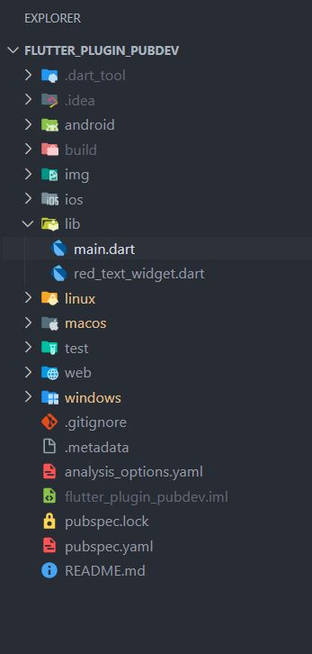
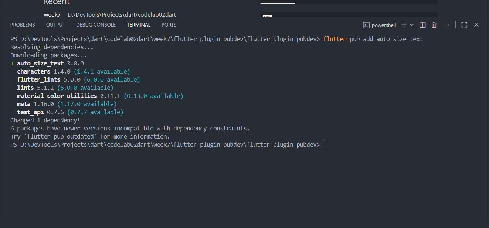
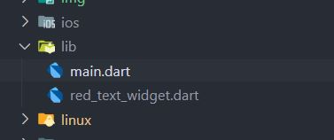
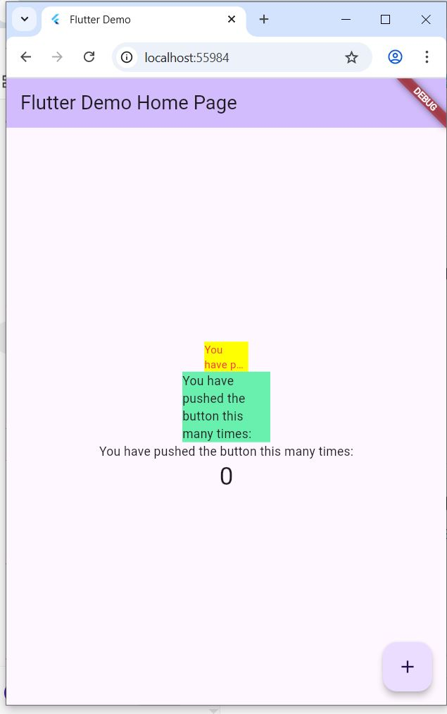

## 7. Praktikum Menerapkan Plugin di Project Flutter

## Langkah 1: Buat Project Baru
Buatlah sebuah project flutter baru dengan nama flutter_plugin_pubdev. Lalu jadikan repository di GitHub Anda dengan nama flutter_plugin_pubdev.

## Jawaban



# Langkah 2: Menambahkan Plugin
Tambahkan plugin auto_size_text menggunakan perintah berikut di terminal


## Jawaban



## Langkah 3: Buat file red_text_widget.dart
Buat file baru bernama red_text_widget.dart di dalam folder lib lalu isi kode seperti berikut.

### 💻 Source Code  
```dart
import 'package:flutter/material.dart';

class RedTextWidget extends StatelessWidget {
  const RedTextWidget({Key? key}) : super(key: key);

  @override
  Widget build(BuildContext context) {
    return Container();
  }
}
```

---

## JAWABAN 



## Langkah 4: Tambah Widget AutoSizeText
Masih di file red_text_widget.dart, untuk menggunakan plugin auto_size_text, ubahlah kode return Container() menjadi seperti berikut.


### 💻 Source Code  
```dart
return AutoSizeText(
      text,
      style: const TextStyle(color: Colors.red, fontSize: 14),
      maxLines: 2,
      overflow: TextOverflow.ellipsis,
);
```

---


# Langkah 5: Buat Variabel text dan parameter di constructor
Tambahkan variabel text dan parameter di constructor seperti berikut.


### 💻 Source Code  
```dart
final String text;

const RedTextWidget({Key? key, required this.text}) : super(key: key);
```

---


# Langkah 6: Tambahkan widget di main.dart
Buka file main.dart lalu tambahkan di dalam children: pada class _MyHomePageState 


### 💻 Source Code  
```dartContainer(
   color: Colors.yellowAccent,
   width: 50,
   child: const RedTextWidget(
             text: 'You have pushed the button this many times:',
          ),
),
Container(
    color: Colors.greenAccent,
    width: 100,
    child: const Text(
           'You have pushed the button this many times:',
          ),
),
```

---


## JAWABAN 


## Selesaikan Praktikum tersebut, lalu dokumentasikan dan push ke repository Anda berupa screenshot hasil pekerjaan beserta penjelasannya di file README.md!
# Jelaskan maksud dari langkah 2 pada praktikum tersebut!
## JAWABAN
sebuah plugin eksternal bernama auto_size_text ke dalam proyek Flutter. Plugin ini berfungsi untuk membuat ukuran teks menyesuaikan secara otomatis dengan ruang tampilan, sehingga teks tidak terpotong dan tetap terlihat proporsional di berbagai ukuran layar.

# Jelaskan maksud dari langkah 5 pada praktikum tersebut!
## JAWABAN 
ditambahkan variabel text bertipe String serta parameter text pada constructor RedTextWidget. Tujuannya agar widget dapat menerima data teks dari luar saat digunakan. Dengan menambahkan required this.text, setiap kali widget dipanggil, nilai teks harus diisi sehingga widget menjadi lebih fleksibel dan dinami

# Pada langkah 6 terdapat dua widget yang ditambahkan, jelaskan fungsi dan perbedaannya!
ditambahkan dua Container pada class _MyHomePageState.
RedTextWidget menampilkan teks dari parameter text dengan latar kuning, sedangkan Text menampilkan teks langsung dengan latar hijau.
Perbedaannya, RedTextWidget lebih dinamis karena menerima teks dari luar, sementara Text bersifat statis.
# Jelaskan maksud dari tiap parameter yang ada di dalam plugin auto_size_text berdasarkan tautan pada dokumentasi ini !
maxLines – Menentukan jumlah maksimum baris teks yang ditampilkan.

minFontSize dan maxFontSize – Mengatur ukuran font terkecil dan terbesar yang diizinkan saat teks menyesuaikan ukuran.

stepGranularity – Menentukan seberapa besar perubahan ukuran font setiap kali teks disesuaikan.

presetFontSizes – Menentukan daftar ukuran font tertentu yang boleh digunakan.

group – Menyinkronkan ukuran teks di beberapa widget AutoSizeText agar sama besar.

overflowReplacement – Menampilkan widget pengganti jika teks tidak muat dalam area tampilan.

textAlign, style, dan maxLines – Bekerja seperti pada widget Text biasa untuk mengatur perataan, gaya, dan jumlah baris teks.


